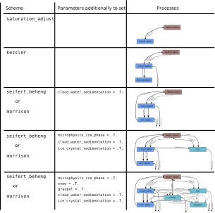

# Bulk Microphysics 

---

## Purpose

The bulk model described here allows for the simulation of clouds, while parameterizing microphysical processes. For the parameterization different schemes with varying complexity can be chosen - from a most simple so-called "all-or-nothing" scheme up to the comprehensive two-moment mixed-phase scheme of Seifert and Beheng (2006). 

## General Information

The Bulk microphysic model is switched on by adding the namelist [`&bulk_cloud_parameters`](../../../../../Reference/LES_Model/Namelists/#bulk-cloud-parameters) to the `_p3d` namelist file. See [`&bulk_cloud_parameters`](../../../../../Reference/LES_Model/Namelists/#bulk-cloud-parameters) for the complete list of available steering parameters.
The complexity and the range of cloud processes that can be represented depend largely on the chosen microphysics scheme, to be selected via parameter [cloud_scheme](../../../../../Reference/LES_Model/Namelists/#bulk_cloud_parameters--cloud_scheme), which is the most important one for the steering of the bulk microphysics. 
The schemes are shortly introduced in the section Available Schemes. 

Switching on the bulk microphysics has several effects:

- Depending on the chosen microphysics scheme, up to ten additional prognostic variables are allocated and computed. For each of the up to five different hydrometeor classes, both the number concentration and the mixing ratio of the respective species are calculated. Computational demands (memory and CPU time) increase appropriately.
- If bulk microphysics is enabled, the model internally uses the liquid water potential temperature (instead of the potential temperature) and the total water mixing ratio (instead of the water vapor mixing ratio) as conserved prognostic quantities. However, for output purposes, the liquid water potential temperature is converted back so that the potential temperature is provided as output.


## Basic Usage / Settings

Clouds and their corresponding setups can be highly diverse, as a wide range of cloud types may occur. **For the correct development of clouds, it is essential to provide a realistic humidity and temperature profile (and a corresponding surface pressure).** These profiles can either be extracted from observations or be based on idealized profiles.
The namelist provided in file [mixed-phase-stratus_with_rrtmg_p3d](https://gitlab.palm-model.org/palm/model/-/blob/master/tests/cases/mixed-phase-stratus_with_rrtmg/INPUT/mixed-phase-stratus_with_rrtmg_p3d) gives a simple setup for a dimulation of mixed-phase arctic stratocumulus. This test case could be chosen as a good starting point for the simulation of other mixed-phase boundary layer clouds.

**Attention:** This file requires that the model dimensions are extended to 3.2 km and the vertical grid spacing to be decreased to 10m before using it for a real simulation.

The following list shows those settings of parameters in the [`&initialization_parameters`](../../../../../Reference/LES_Model/Namelists/#initializaton-parameters) namelist, which are specific for an arctic mixed-phase simulation. Explanations will be given below the list.
```Fortran
!
!-- initialization of vertical profiles
!-------------------------------------------------------------------------------
    initializing_actions       = 'set_constant_profiles', ! initial conditions
    ug_surface                 = -7.0, ! u-comp of geostrophic wind at surface
    vg_surface                 = -2.0, ! v-comp of geostrophic wind at surface

    pt_surface                 = 263.0,                     ! temperature at surface
    pt_vertical_gradient       = 0.5, 0.0, 1.16             ! vertical gradient of temperature
    pt_vertical_gradient_level = 0.0, 400.0, 800.0, 1400.0, ! height level of temp gradients

    q_surface                  = 0.0018,                    ! mixing ratio at surface
    q_vertical_gradient        = -8.0e-5, 0.0, -0.001,      ! gradient for mix. ratio
    q_vertical_gradient_level  = 0.0, 400.0, 800.0, 810.,   ! height lev. for gradients

    humidity                   = .TRUE.,   ! turn on humidity, i.e. prog. q
!-- surface
!-------------------------------------------------------------------------------
    surface_pressure  = 1020.0,    ! pressure on surface in hPa
    roughness_length  = 4.0E-4,    ! roughness length in m

!
!-- geographical and temporal setup
!-------------------------------------------------------------------------------
    latitude         = 71.32,                      ! latitude in °N
    longitude        = -156.61,                    ! longitude in °E
    origin_date_time = '2018-04-26 18:00:00 +00',  ! date and time
    omega             = 0.0,                       ! Turnoff Coriolis Force

!
!-- large scale subsidence and nudging
!-------------------------------------------------------------------------------
    large_scale_subsidence       = .TRUE.,
    subs_vertical_gradient_level =  0.0, 825.0,
    subs_vertical_gradient       = -5.0E-4,

!
!-- allow to start with supersaturated environment
!-------------------------------------------------------------------------------
   check_realistic_q = .FALSE.,    
```
- The atmospheric setup is based on the validation case described in Ovchinnikov et al., 2014. However, the nudging terms and some further case specific modifications are not included in the provided case template.
- The initialized temperature and humidity profiles used here result in a supersaturated layer, which is converted into liquid water and ice water during the first time step. To initialize the model with such a supersaturated atmosphere, the parameter [check_realistic_q](../../../../../Reference/LES_Model/Namelists/#initialization_parameters--check_realistic_q) = *.F.*. must be set.
- To achieve a steady-state in this setup, large-scale subsidence is additionally included. 
- The georeferencing is necessary for the correct application of the coupled radiation model.


The specific bulk cloud parameter settings in the example file [mixed-phase-stratus_with_rrtmg_p3d](https://gitlab.palm-model.org/palm/model/-/blob/master/tests/cases/mixed-phase-stratus_with_rrtmg/INPUT/mixed-phase-stratus_with_rrtmg_p3d). are:
```Fortran
&bulk_cloud_parameters
!
!-- set microphyiscs scheme
!-------------------------------------------------------------------------------
    cloud_scheme              = 'seifert_beheng', ! two-moment liquid water microphysics
                                                  ! including autoconversion,
                                                  ! accretion, sedimentation, precipitation
!
!-- steering of liquid phase
!-------------------------------------------------------------------------------
    collision_turbulence              = .TRUE.,   ! parametize turbulence effects for collision
    cloud_water_sedimentation         = .TRUE.,   ! enable cloud water sedimentation
    nc_const                          = 200.0E6,  ! cloud droplet concentration
    call_microphysics_at_all_substeps = .FALSE.,  ! microphysics every sub-timestep disabled

!
!-- steering of ice phase
!-------------------------------------------------------------------------------
    microphysics_ice_phase    = .TRUE.,           ! turn on ice microphysics
    in_init                   = 4000.0,           ! set ice nucleii concentration
    ice_crystal_sedimentation = .TRUE.,           ! turn on ice sedimentation
    snow                      = .TRUE.,           ! turn on prog. quantities for snow
    graupel                   = .TRUE.,           ! turn on prog. quantities for graupel
    start_ice_microphysics    = 0.0,              ! start with ice microphysics at model start
```
Meaning of the single parameters can be found in the [`&bulk_cloud_parameters`](../../../../../Reference/LES_Model/Namelists/#bulk-cloud-parameters) reference. However, it needs to be mentioned that in many cases the evolution of the cloud and whether precipitation is forming or not is highly sensitive to the parameters [nc_const](../../../../../Reference/LES_Model/Namelists/#bulk_cloud_parameters--nc_const) (or [na_init](../../../../../Reference/LES_Model/Namelists/#bulk_cloud_parameters--na_init), if the [cloud_scheme](../../../../../Reference/LES_Model/Namelists/#bulk_cloud_parameters--cloud_scheme) = *'morrison'* is used) and [in_init](../../../../../Reference/LES_Model/Namelists/#bulk_cloud_parameters--in_init).

**Attention:** The parameter [microphysics_ice_phase](../../../../../Reference/LES_Model/Namelists/#bulk_cloud_parameters--microphysics_ice_phase) = *.T.*. should only be used, if you expect to have ice hydrometeors during your simulation, i.e. if temperatures drop significantly below 0°C. Otherwise, a lot of computational time would be spend for solving equations that are irrelevant for the setting. 

Beyond mixed-phase microphysics commonly only-liquid microphysics are used, i.e., for the simulation of shallow cumulus clouds. For such a setting see file [warm_air_bubble_with_bcm_p3d](https://gitlab.palm-model.org/palm/model/-/blob/master/tests/cases/warm_air_bubble_with_bcm/INPUT/warm_air_bubble_with_bcm_p3d).

## Available schemes

The figure below presents short graphs of the processes that are included in the different cloud schemes.

{width=100%} <br>
**Figure 1:** Overview of the available bulk microphysics schemes. The second column shows the parameters to switch on the respective scheme, and the third column displays the processes included in the scheme.

The different schemes are arranged by increasing complexity from top to bottom. In general, the bulk microphysics model works as follows. It calculates, depending on the complexity of the chosen scheme, up to two moments (number concentration and mixing ratio) for up to five different hydrometeor classes (cloud water, rain water, ice, snow, and graupel). The prognostic equations contain microphysical processes of varying complexity depending on the selected scheme. These processes mainly include phase transitions (condensation, evaporation, deposition, melting, and freezing), coagulation processes (autoconversion, accretion, selfcollection, breakup, aggregation, riming), and sedimentation. A detailed description of all processes can be found in the [reference section](../../../../Reference/LES_Model/Modules/Cloud_Microphysics/bulk_microphysics_reference.md).

Which scheme to be chosen mainly depends on the specific objectives of the simulation. The following characteristics distinguish the available schemes to be chosen via parameter [cloud_scheme](../../../../../Reference/LES_Model/Namelists/#bulk_cloud_parameters--cloud_scheme):

- *'saturation_adjust'* <br>is not really a microphysical scheme. It just converts supersaturations into liquid water. Nothing else is considered. This scheme should only be used, if nothing (in terms of clouds) than the presence of liquid water is of interest. 

- *'kessler'*<br> is a one-moment microphysics scheme according to Kessler (1969). It uses saturation adjustment to diagnose cloud water. Precipitation is only roughly estimated if a certain threshold in cloud water is exceeded. 

- *'seifert_beheng'*<br> is a two-moment microphysics scheme according to Seifert and Beheng (2006) which is based on the separation of the droplet spectrum into droplets with radii < 40 μm (cloud droplets) and droplets with radii ≥ 40 μm (rain droplets). In line with the operative mode of the ICON microphysics implementation of SB2006 a fixed cloud droplet number concentration is used which can be set with [nc_const](../../../../../Reference/LES_Model/Namelists/#bulk_cloud_parameters--nc_const). 

- *'morrison'*<br> This scheme is actually nearly the same two-moment microphysics scheme according to Seifert and Beheng (2006). However, there are three main differences. First, instead of saturation adjustment, the diffusional growth is parametrized while calculating condensation/evaporation rates, explicitly. For appropriate usage of this scheme, the time step must be smaller than the diffusional growth relaxation time. Usually, this is on the order of 1-2 seconds. This time step must be set manually via parameter [dt](../../../../../Reference/LES_Model/Namelists/#initialization_parameters--dt) as no time constraint is implemented. Second, activation is considered with a simple Twomey activation-scheme. Koehler-theory accounts for this with the parameter [curvature_solution_effects_bulk](../../../../../Reference/LES_Model/Namelists/#bulk_cloud_parameters--curvature_solution_effects_bulk) = *.T.*. The background aerosol concentration, which determines the maximum number of activated cloud droplets, can be prescribed with [na_init](../../../../../Reference/LES_Model/Namelists/#bulk_cloud_parameters--na_init). Thirdly, the number concentration of cloud droplets (`nc`) and the cloud water mixing ratio (`qc`) are prognostic quantities.

**Attention:** The aforementioned schemes have been originally implemented for only-liquid microphysics. To turn on the mixed-phase microphysics for [cloud_scheme](../../../../../Reference/LES_Model/Namelists/#bulk_cloud_parameters--cloud_scheme) = *'seifert_beheng'* or [cloud_scheme](../../../../../Reference/LES_Model/Namelists/#bulk_cloud_parameters--cloud_scheme) = *'morrison'*  the following parameters must be set:

- The parameter [microphysics_ice_phase](../../../../../Reference/LES_Model/Namelists/#bulk_cloud_parameters--microphysics_ice_phase) = *.T.* turns on the ice phase, i.e., the prognostic equations for ice crystal number concentration and ice crystal mixing ratio. By default, only phase transitions are considered. The ice crystals are assumed to be an idealization of dendrites as spheres (following Ovchinnikov et al., 2014). Sedimentation of this hydrometeor class can be enabled by setting [ice_crystal_sedimentation](../../../../../Reference/LES_Model/Namelists/#bulk_cloud_parameters--ice_crystal_sedimentation) = *.T.*. This setting was used (with some adaptations) to validate the mixed-phase microphysics scheme using the model intercomparison setup of Ovchinnikov et al., 2014 by simulating mixed-phase Arctic stratocumulus. Hence, this parameter (in combination with [cloud_scheme](../../../../../Reference/LES_Model/Namelists/#bulk_cloud_parameters--cloud_scheme) = *'seifert_beheng'* or [cloud_scheme](../../../../../Reference/LES_Model/Namelists/#bulk_cloud_parameters--cloud_scheme) = *'morrison'*) can be used to simulate shallow, non-precipitating mixed-phase clouds.
- Additionally, the parameters [snow](../../../../../Reference/LES_Model/Namelists/#bulk_cloud_parameters--snow) = *.T.* and [graupel](../../../../../Reference/LES_Model/Namelists/#bulk_cloud_parameters--graupel) = *.T.* should be turned on if a complete mixed-phase microphysics is needed. This is appropriate for deep convection or other kinds of clouds in which precipitation processes via the ice phase are expected.


## Coupling to other PALM modules

The bulk microphyiscs module can be used (and have been tested) in combination with the following modules:

- radiation (only RRTMG)
- land surface model
- self-nesting (but not rigorously tested)
- lagrangian particle model (but not particles as a lagrangian cloud model)
- topography

## Limitations

Following limitations apply for the bulk microphysics module:

- no dewfall on the land-surface type pavement is implemented
- while mesoscale nesting is generally possible for simulation with turned on bulk microphysics, the coupling of cloud quantities is not implemented yet. 

The bulk microphyiscs model can not be used in combination with the following PALM modules or settings:

- ocean mode
- urban surface model in combination with the RTM
- lagrangian cloud model
- mesoscale nesting (in terms of cloud specie coupling)
- plant canopy model (if cloud [cloud_scheme](../../../../../Reference/LES_Model/Namelists/#bulk_cloud_parameters--cloud_scheme) = *'seifert_beheng'* is used).

## Reference

For more detailed scientific and technical information about the bulk microphysics model see the [reference section](../../../../Reference/LES_Model/Modules/Cloud_Microphysics/bulk_microphysics_reference.md).


## Notes, shortcomings and open issues

1. A hail scheme is not implemented. 

2. Some useful output quantities (such as radar reflectivity) have not been implemented so far.

