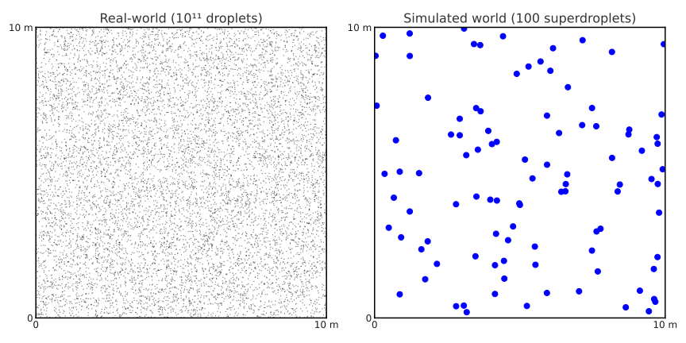

# Lagrangian Particle-based Cloud Microphysics 

---

## Purpose

Beside the bulk cloud microphysics PALM offers an opportunity to simulate cloud and their microphysics by first principles with a so-called Lagrangian particle-based approach or Lagrangian Cloud Model (LCM). The LCM directly simulates the evolution of cloud droplets. Many physical processes (like diffusional growth or drag force) are explicitly considered without using any parameterization. Collision processes are parameterized. However, for applications where this level of detail is not required (such as when the main interest is in the effect of cloud-radiation interactions for real-case scenario simulations) the bulk cloud microphysics scheme is recommended.

## General Information

The core concept of the LCM is to represent the vast number of aerosol particles, cloud, and rain droplets within a model grid cell by a carefully chosen ensemble of Lagrangian point particles, commonly referred to as superdroplets or superparticles (in the following abbreviated as SD). These SDs are advected through physical space according to the PALM  flow field, and their size evolves as they move (by diffusional growth and coagulation). Each SD stands for a large group of actual cloud droplets (see Figure 1), with a parameter called weighting-factor specifying how many real particles are represented by a single SD. Over the past decade, Lagrangian particle-based microphysics has become increasingly popular, with significant contributions from our group (Riechelmann et al., 2012, Hoffmann et al., 2015, Hoffmann et al., 2017, Schwenkel et al., 2018) alongside the foundational studies by Andrejczuk et al. (2008, 2010), Shima et al. (2009), and Sölch and Kärcher (2010).

 <br>
**Figure 1:** Left: Real cloud air with approximately $10^{11}$ droplets in $1000\,\textrm{m}^3$ (reduced to $10^{5}$ droplets for visualization purposes) (a typical LES grid box) of cloudy air. Right: Simulated world with 100 SDs in the same grid box, where each SD has a weighting factor of $10^9$.


It is important to note that, from a software perspective, the LCM is not a standalone module but rather a component of the broader Lagrangian Particle Model. This model can also be used for other applications, such as dispersion modelling, or determination of footprints. When operated as an LCM, however, it is coupled to the flow field through the release of latent heat.

Accordingly, the LCM is activated by adding the namelist [`&particle_parameters`](../../../../../Reference/LES_Model/Namelists/#particle-parameters) to the `_p3d` namelist file. See [`&particle_parameters`](../../../../../Reference/LES_Model/Namelists/#particle-parameters) for the complete list of available steering parameters. However, not all of them are of particular interest for the LCM. 

## Basic Usage / Settings

As with the bulk microphysics scheme, it is essential to specify accurate temperature and humidity profiles (as well as an appropriate surface pressure) to ensure that clouds can develop realistically.

A simple warm cumulus cloud using the LCM is provided in file [warm_air_bubble_lcm_p3d](https://gitlab.palm-model.org/palm/model/-/blob/master/tests/cases/warm_air_bubble_lcm/INPUT/warm_air_bubble_lcm_p3d). Try using this setup for first tests of LCM, and then modify it towards your intended application. **Attention:** This file requires adjustments before using it for a real simulation. 

The following list shows those settings of parameters in the [`&initialization_parameters`](../../../../../Reference/LES_Model/Namelists/#initializaton-parameters) which are specific for LCM simulations. Explanations will be given below the list.

```Fortran
!
!-- initialization and vertical profiles
!-------------------------------------------------------------------------------
    initializing_actions       = 'set_constant_profiles initialize_bubble', 
                                         ! initial conditions (with warm air bubble)

    ug_surface                 = 0.0,    ! u-comp of geostrophic wind at surface
    surface_pressure           = 1015.4, ! surface pressure

    pt_surface                 = 297.9,            ! temperature at surface
    pt_vertical_gradient       = 0.0, 0.585,       ! vertical gradient of temperature
    pt_vertical_gradient_level = 0.0, 740.0,       ! height level of temp gradients

    q_surface                  = 0.016,                         ! mixing ratio at surface
    q_vertical_gradient        = -2.97E-4, -4.52E-4, -8.1E-5,   ! gradient for mix. ratio
    q_vertical_gradient_level  = 0.0, 740.0, 3260.0,            ! height lev. for gradients
         
!          
!--  humdity and microphysics
!-------------------------------------------------------------------------------
     humidity                  = .TRUE.,  ! enables prog. equation for total water mixing ratio
     cloud_droplets            = .TRUE.,  ! instead the lcm is used for microphysics
```

- The LCM is turned on via 
 the [`&initialization_parameters`](../../../../../Reference/LES_Model/Namelists/#initializaton-parameters) by setting the parameter
 [cloud_droplets](../../../../../Reference/LES_Model/Namelists/#initialization_parameters--cloud_droplets) = *.T.*. As a consequence humidity (and a proper humidity profile) is required, i.e., [`&initialization_parameters`](../../../../../Reference/LES_Model/Namelists/#initializaton-parameters) [humidity](../../../../../Reference/LES_Model/Namelists/#initialization_parameters--humidity) = *.T.* needs t be set. 
 - The atmospheric setup is based on the RICO case described in vanZanten et al., 2011.
 - Clouds are triggered by a warm air bubble which is realized by initializing a temperature anomaly centered along the y-direction of the model domain in a height of 150 m (and homogeneous along x-direction). The temperature perturbation decreases with a standard deviation of 300 m and 150 m along y and z, respectively.
  


The specific LCM settings in the example file [warm_air_bubble_lcm](https://gitlab.palm-model.org/palm/model/-/blob/master/tests/cases/warm_air_bubble_lcm/INPUT/warm_air_bubble_lcm_p3d). are:
```Fortran
!-------------------------------------------------------------------------------
!-- PARTICLE PARAMETER NAMELIST
!-------------------------------------------------------------------------------
&particle_parameters  
!
!-- initialize particles in model domain
!-------------------------------------------------------------------------------
    psb                        = 20.0,   ! bottom of particle source
    pst                        = 2000.0, ! top of particle source
    
    pdx                        = 25.0,   ! distance between particles along x
    pdy                        = 25.0,   ! distance between particles along y
    pdz                        = 25.0,   ! distance between particles along z
    
    random_start_position      = .FALSE., ! add random start positions
    number_of_particle_groups  = 1,       ! only one particle group is used
    particle_advection_start   = 700,     ! particles are released after 700s

!
!-- boundary conditions
!-------------------------------------------------------------------------------
    bc_par_b                  = 'absorb',  ! bottom boundary condition for particles
    bc_par_t                  = 'reflect', ! top boundary condition for particles   
!
!-- initialize particle model as lagrangian cloud model
!-------------------------------------------------------------------------------
    density_ratio              = 0.001,   ! density ratio of particles (air=1, liquid water = 1000)
    radius                     = 1.0E-6,  ! initial radius of particles

    curvature_solution_effects = .FALSE., ! switch off koehler effects
    collision_kernel           = 'hall',  ! enabales collision 
    number_concentration       = 50.0E6,  ! initialize particles with a weighting factor 
                                          ! such that a number number concentration of
                                          ! 50 cm^-3 is obtained 
    use_sgs_for_particles      = .FALSE., ! disable SGS velocities for particles    
    
!
!-- particle output 
!-------------------------------------------------------------------------------                
    dt_dopts                   = 60.0,      ! time interval for particle timeseries                                            
    data_output_pts             = 'tnpt',
                                  'radius_', 
                                  'r_min',
                                  'r_max',                                          
/ ! end of lcm parameters                                        
```
Meaning of the single parameters can be found in the [`&particle_parameters`](../../../../../Reference/LES_Model/Namelists/#particle-parameters) reference.
In the following, however, some of the crucial parameters are outlined shortly:

- The parameter [density_ratio](../../../../../Reference/LES_Model/Namelists/#particle_parameters--density_ratio) is crucial for simulating cloud droplets, as it prescribes the inertia of the particles (ratio of the density of the fluid to the density of the particles). Since only liquid phase microphysics is implemented in the LCM, the density ratio should be set to 0.001.
- The number concentration of cloud droplets mostly depends on the aerosol properties. However, if [curvature_solution_effects](../../../../../Reference/LES_Model/Namelists/#particle_parameters--curvature_solution_effects) is not explicitly turned on, then the number concentration of cloud droplets depends on the initial multiplicity of the SDs. This can be described by two parameters. First, by setting the parameter [initial_weighting_factor](../../../../../Reference/LES_Model/Namelists/#particle_parameters--initial_weighting_factor) to a proper value, e.g., if aiming to simulate a number concentration of 100 cm$^{-3}$ using a 10 m isotropic grid spacing with 100 SDs per grid box, this would result in an [initial_weighting_factor](../../../../../Reference/LES_Model/Namelists/#particle_parameters--initial_weighting_factor) of $10^{9}$. Second, the same effect would be reached by setting [number_concentration](../../../../../Reference/LES_Model/Namelists/#particle_parameters--number_concentration) to 100.0E6.
- Collision processes can be enabled by setting [collision_kernel](../../../../../Reference/LES_Model/Namelists/#particle_parameters--collision_kernel). By doing so, an all-or-nothing algorithm (Unterstrasser et al., 2017) is applied, calculating the collisional probability of each SD pair within one grid box at each time step. Coalescence probability is set to unity. Depending on the specific setup (especially the number of SDs used per grid box), this algorithm can be CPU demanding.
- A strength of the LCM is its ability to apply cloud microphysics from first principles. Thus, Koehler theory can also be applied explicitly. To do so, the parameter [curvature_solution_effects](../../../../../Reference/LES_Model/Namelists/#particle_parameters--curvature_solution_effects) = *.T.* must be set. Aerosol properties can be prescribed manually by a tri-modal distribution or by using well-described aerosol environments (see e.g. [aero_species](../../../../../Reference/LES_Model/Namelists/#particle_parameters--aero_species)). Note that considering curvature and solution effects leads to internal time-stepping and, depending on the specific setup, can significantly increase computational time. 
- For this test-setup the particle advection is started after 700.0 s ([particle_advection_start](../../../../../Reference/LES_Model/Namelists/#particle_parameters--particle_advection_start) = 700.0). For your realistic simulation it is recommended that particle advection should be started at the beginning of the simulation (or after spin-up).


## Limitations
The following combinations are not allowed or implemented:

- Nesting and LCM
- LCM in combination with the bulk cloud model.


## Reference

For more detailed scientific and technical information about the LCM see the [reference section] ../../../../Reference/LES_Model/Modules/Cloud_Microphysics/lagrangian.md. (**Currently under preparation**).


## Notes, shortcomings and open issues

1. From a technical point of view, the implementation of the LCM is part of the Lagrangian particle model (LPM). Thus, also read the LPM guide to get a better understanding of how to configure and use the LCM. Many aspects are the same (e.g., how to define a particle source or data output) and have not been addressed here again to avoid redundancy.

2. The LCM is highly parallelized, which is why it is generally possible to run simulations with hundreds of millions of particles. However, if particles are not equally distributed in the model domain, CPU performance will significantly drop due to load imbalancing.

3. There is no implicit time-stepping algorithm implemented to guarantee numerical robustness. Using explicit condensation requires small time steps of about 0.1 s. Therefore, [dt](../../../../../Reference/LES_Model/Namelists/#runtime_parameters--dt) needs to be set manually.

4. The LCM is designed to study cloud microphysics in detail. While it is generally possible to use many other PALM modules in combination with the LCM, it needs to be noted here that such setups have not been tested nor validated. 

5. The LCM only accounts for liquid-phase microphysics. The simulation of ice hydrometeor species is not implemented. 

