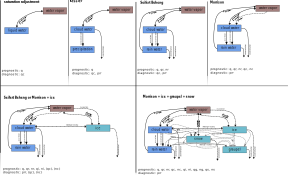

# Bulk Microphysics Module Reference

---

## Overview

This reference primarily describes the model equations of the bulk microphysics. For a better understanding of how the bulk model should be driven, please refer to the [guide section](../../../../Guide/LES_Model/Modules/Cloud_Microphysics/bulk_microphysics.md).

**Note:**   The description of the model equations is still under development, and the description of the ice and mixed-phase processes is missing. For these, see Seifert and Beheng (2006).

## Model Description (Model Equations)

### Liquid water potential temperature

When using the bulk microphysics PALM solves the prognostic equations for the total water mixing ratio

$$
q = q_\mathrm{v} + q_\mathrm{l} \, ,
$$

instead of $q_\mathrm{v}$, and for a linear approximation of the liquid water potential temperature (Emmanuel, 1994):

$$
\theta_\mathrm{l} = \theta - \frac{L_\mathrm{V}}{c_p \Pi} q_\mathrm{l}\,,
$$

instead of $\theta$ as described in section [governing equations](https://palm.muk.uni-hannover.de/trac/wiki/doc/tec/gov). Since $q$ and $\theta_\mathrm{l}$ are conserved quantities for wet adiabatic processes, condensation/evaporation is not considered for these variables. 
In case of mixed-phase microphysics the ice-liquid water potential temperature is used instead.

### Cloud schemes 

PALM offers different schemes of Kessler (1969), Seifert and Beheng (2001,2006), Morrison et al. (2005) for the treatment of liquid phase microphysics. Depending of the choice of the microphysical scheme different prognostic quantities are used and different microphysical processes are considered. 
The different schemes are:

An overview of the processes and the prognostic and diagnostic quantities is given in the following figure.

{width=100%}  
**Figure 1:** Overview of the available bulk microphysics schemes.

#### Saturation Adjustment

Actually, the saturation adjustment scheme does not represent s particular microphysics scheme. It just converts the excess supersaturation into liquid water by neglecting all other microphysical processes. 

#### Kessler

The Kessler (1969) scheme provides a computational inexpensive way for the bulk microphysics. However, it only converts supersaturation into liquid water and considering autoconversion after a parameterization of Kessler (1969). 

#### Seifert and Beheng

A more detailed parameterization is given by following the two-moment scheme of Seifert and Beheng (2001,2006), which is based on the separation of the droplet spectrum into droplets with radii < 40 μm (cloud droplets) and droplets with radii ≥ 40 μm (rain droplets). Here, the model predicts the first two moments of these partial droplet spectra, namely cloud and rain droplet number concentration (Nc and Nr, respectively) as well as cloud and rain water mixing ratio ($q_\mathrm{c}$ and $q_\mathrm{r}$, respectively). Consequently, $q_\mathrm{l}$ is the sum of both $q_\mathrm{c}$ and $q_\mathrm{r}$. The moments' corresponding microphysical tendencies are derived by assuming the partial droplet spectra to follow a gamma distribution that can be described by the predicted quantities and empirical relationships for the distribution's slope and shape parameters. For a detailed derivation of these terms, see Seifert and Beheng (2001,2006).

We employ the computational efficient implementation of this scheme as used in the UCLA-LES (Savic-Jovcic and Stevens, 2008) and DALES (Heus et al., 2010) models.

#### Morrison

The Morrison et al. (2007) microphysics scheme can be understood as an extension of the scheme of Seifert and Beheng (2001,2006), where $N_\mathrm{c}$ and $q_\mathrm{c}$ are prognostic quantities as well. Actually, the name is a bit misleading as for coagulation processes the parameterization of SB2006 is used. 
However, there are three main differences.
First, instead of saturation adjustment, the diffusional growth is parametrized while calculating condensation/evaporation rates, explicitly. Second, activation is considered with a simple Twomey activation-scheme.  Thirdly, the number concentration of cloud droplets $n_\mathrm{c}$ and the cloud water mixing ratio $q_\mathrm{c}$ are prognostic quantities. 

#### Mixed-phase microphysics

With the cloud schemes SB2006 and Morrison also ice species are included based on the microphysics scheme SB2006 and their implementation in ICON. 
A more detailed description is under preparation and will follow with the next release. 

### Tendency equations of hydrometeors

In the next subsections, the diagnostic or prognostic determination (depending on the chosen scheme) of different moments and hydrometeor are described. From section *activation* onward, the microphysical processes considered in the sink/source terms of $\theta_\mathrm{l}$, $q$, $N_\mathrm{r}$, $q_\mathrm{r}$, $N_\mathrm{i}$, $q_\mathrm{i}$, as well as $N_\mathrm{c}$ and $q_\mathrm{c}$ for the Morrison et al. (2005) scheme are:

$$
\begin{align*}
  &  \Psi_{\theta_\mathrm{l}} = - \frac{L_\mathrm{v}}{c_p \Pi} \varphi_q, \,\\
  &  \Psi_{q}  = \left.\frac{\partial q}{\partial t} \right|_\text{sed, c} + \left.\frac{\partial q}{\partial t} \right|_\text{sed, r}, \, \\
  &  \Psi_{N_\mathrm{r}} = \left.\frac{\partial N_\mathrm{r}}{\partial t} \right|_{\text{auto}}+ \left.\frac{\partial N_\mathrm{r}}{\partial t} \right|_\text{slf/brk}+ \left.\frac{\partial N_\mathrm{r}}{\partial t} \right|_{\text{evap}}+ \left.\frac{\partial N_\mathrm{r}}{\partial t} \right|_\text{sed, r}, \,\\
  & \Psi_{q_\mathrm{r}} = \left.\frac{\partial
      q_\mathrm{r}}{\partial t} \right|_{\text{auto}} +
  \left.\frac{\partial q_\mathrm{r}}{\partial t}
  \right|_{\text{accr}}+ \left.\frac{\partial q_\mathrm{r}}{\partial
      t} \right|_{\text{evap}}+ \left.\frac{\partial
      q_\mathrm{r}}{\partial t} \right|_\text{sed, r}, \,\\
  &  \Psi_{N_\mathrm{c}} = \left.\frac{\partial N_\mathrm{c}}{\partial t} \right|_{\text{acti}}+ \left.\frac{\partial N_\mathrm{c}}{\partial t} \right|_\text{auto}+ \left.\frac{\partial N_\mathrm{c}}{\partial t} \right|_{\text{evap}}+ \left.\frac{\partial N_\mathrm{c}}{\partial t} \right|_\text{sed, c}, \,\\
  & \Psi_{q_\mathrm{c}} = \left.\frac{\partial
      q_\mathrm{c}}{\partial t} \right|_{\text{auto}} +
  \left.\frac{\partial q_\mathrm{c}}{\partial t}
  \right|_{\text{accr}}+ \left.\frac{\partial q_\mathrm{c}}{\partial
      t} \right|_{\text{cond,evap}}+ \left.\frac{\partial
      q_\mathrm{c}}{\partial t} \right|_\text{sed, c}, \,\\
  & \Psi_{N_\mathrm{i}} = \left.\frac{\partial
      N_\mathrm{i}}{\partial t} \right|_{\text{nucle}} + \left.\frac{\partial
      N_\mathrm{i}}{\partial t} \right|_{\text{freez./melt.}} + \left.\frac{\partial
      N_\mathrm{i}}{\partial t} \right|_{\text{aggr.}} + \left.\frac{\partial
      N_\mathrm{i}}{\partial t} \right|_{\text{selfc.}} \left.\frac{\partial
      N_\mathrm{i}}{\partial t} \right|_{\text{rimi.}} + + \left.\frac{\partial
      N_\mathrm{i}}{\partial t} \right|_\text{sed, i}, \,\\
  & \Psi_{q_\mathrm{i}} = \left.\frac{\partial
      q_\mathrm{i}}{\partial t} \right|_{\text{depo/subli}} + \left.\frac{\partial
      q_\mathrm{i}}{\partial t} \right|_{\text{freez./melt.}} + \left.\frac{\partial
      q_\mathrm{i}}{\partial t} \right|_{\text{aggr.}} + \left.\frac{\partial
      q_\mathrm{i}}{\partial t} \right|_{\text{selfc.}} + \left.\frac{\partial
      q_\mathrm{i}}{\partial t} \right|_{\text{rimi.}} + \left.\frac{\partial
      q_\mathrm{i}}{\partial t} \right|_\text{sed, i} \, \\
  & \Psi_{N_\mathrm{g}} = \left.\frac{\partial
      N_\mathrm{g}}{\partial t} \right|_{\text{freez./melt.}} + \left.\frac{\partial
      N_\mathrm{g}}{\partial t} \right|_{\text{aggr.}} + \left.\frac{\partial
      N_\mathrm{g}}{\partial t} \right|_{\text{selfc.}} + \left.\frac{\partial
      N_\mathrm{g}}{\partial t} \right|_{\text{rimi.}} + \left.\frac{\partial
      N_\mathrm{g}}{\partial t} \right|_\text{sed, g}, \,\\
  & \Psi_{q_\mathrm{g}} = \left.\frac{\partial
      q_\mathrm{g}}{\partial t} \right|_{\text{depo/subli}} + \left.\frac{\partial
      q_\mathrm{g}}{\partial t} \right|_{\text{melt./freez.}} + \left.\frac{\partial
      q_\mathrm{g}}{\partial t} \right|_{\text{aggr.}} + \left.\frac{\partial
      q_\mathrm{g}}{\partial t} \right|_{\text{rimi.}} + \left.\frac{\partial
      q_\mathrm{g}}{\partial t} \right|_\text{sed, g} \, \\
  & \Psi_{N_\mathrm{s}} = \left.\frac{\partial
      N_\mathrm{s}}{\partial t} \right|_{\text{freez./melt.}} + \left.\frac{\partial
      N_\mathrm{s}}{\partial t} \right|_{\text{aggr.}} + \left.\frac{\partial
      N_\mathrm{s}}{\partial t} \right|_{\text{selfc.}} + \left.\frac{\partial
      N_\mathrm{s}}{\partial t} \right|_{\text{rimi.}} + \left.\frac{\partial
      N_\mathrm{s}}{\partial t} \right|_\text{sed, s}, \,\\
  & \Psi_{q_\mathrm{s}} = \left.\frac{\partial
      q_\mathrm{s}}{\partial t} \right|_{\text{depo/subli}} + \left.\frac{\partial
      q_\mathrm{s}}{\partial t} \right|_{\text{melt./freez.}} + \left.\frac{\partial
      q_\mathrm{s}}{\partial t} \right|_{\text{aggr.}} + \left.\frac{\partial
      q_\mathrm{s}}{\partial t} \right|_{\text{rimi.}} + \left.\frac{\partial
      q_\mathrm{s}}{\partial t} \right|_\text{sed, s} \, .
\end{align*}
$$

These are used in the formulations of Seifert and Beheng (2006) unless explicitly specified. Section *turbulence closure* gives an overview of the necessary changes for the turbulence closure using $q$ and $\theta_\mathrm{l}$ instead of $q_\mathrm{v}$ and $\theta$, respectively.

### Activation of droplets

The use of the extension described in Morrison et al. (2007) enables a prognostic equation for the cloud droplet number concentration. In this approach, cloud droplets are activated depending on the current supersaturation. This basic method is known as the Twomey activation scheme, which generally takes the form:

$$
N_\mathrm{CCN} = N_0 \times S^k \, ,
$$

where $N_\mathrm{CCN}$ is the number of activated aerosols, $N_0$ is the number concentration of dry aerosol, $S$ is the supersaturation, and $k$ is a power index between 0 and 1. In PALM, the supersaturation is calculated explicitly from the thermodynamic fields of potential temperature and water vapor mixing ratio.

Curvature and solution effects can be included using the analytical extension of the Twomey-type activation scheme by Khvorostyanov and Curry (2006). In this case, the number of activated aerosols is calculated as:

$$
N_\mathrm{CCN} = \frac{N_0}{2} \left[1 - \mathrm{erf}(u)\right] \, , \hspace{1.5cm} u = \frac{\ln(S_0/S)}{\sqrt{2} \ln \sigma_s} \, ,
$$

where $\mathrm{erf}$ is the Gaussian error function, and

$$
S_0 = r_\mathrm{d0}^{-(1+\beta)} \left(\frac{4A^3}{27b}\right)^{1/2}, \\
\sigma_s = \sigma_\mathrm{d}^{1+\beta} \, .
$$

Here, $A$ is the Kelvin parameter, and $b$ and $\beta$ depend on the chemical composition and physical properties of the dry aerosol.

Since aerosol is not predicted in this scheme, the number of previously activated aerosols is assumed to be equal to the number of droplets $N_c$. Therefore, the actual activation rate is given by:

$$
\left. \frac{\partial N_c}{\partial t} \right|_{\text{acti}} = \max\left(\frac{N_\mathrm{CCN} - N_c}{\Delta t}, 0\right).
$$

### Diffusional growth of cloud water

By using the Seifert and Beheng (2001, 2006) scheme, the diagnostic estimation of $q_c$ is based on the assumption that water supersaturations are immediately removed by the diffusional growth of cloud droplets only. This is justified since the bulk surface area of cloud droplets greatly exceeds that of raindrops (Stevens and Seifert, 2008). Following this saturation adjustment approach, $q_c$ is obtained by

$$
q_\mathrm{c} = \max\left(0, q - q_\mathrm{r} - q_\mathrm{s}\right) \; ,
$$

where $q_s$ is the saturation mixing ratio. Because $q_s$ is a function of $T$ (which is not predicted), $q_s$ is computed from the liquid water temperature $T_l = \Pi \theta_l$ in a first step:

$$
q_\mathrm{s}(T_\mathrm{l}) = \frac{R_\mathrm{d}}{R_\mathrm{v}}
\frac{p_\text{v, s}(T_\mathrm{l})}{p - p_\text{v, s}(T_\mathrm{l})} \; ,
$$

using an empirical relationship for the saturation water vapor pressure $p_{v,s}$ (Bougeault, 1981):

$$
p_\text{v, s}(T_\mathrm{l}) = 610.78\,\text{Pa} \cdot
\exp\left(17.269\,\frac{T_\mathrm{l}-273.16\,\text{K}}{T_\mathrm{l}-35.86\,\text{K}}\right) \; .
$$

$q_s(T)$ is subsequently calculated from a first-order Taylor series expansion of $q_s$ at $T_l$ (Sommeria and Deardorff, 1977):

$$
q_\mathrm{s}(T) = q_\mathrm{s}(T_\mathrm{l})\frac{1+\beta\,q}{1+\beta\,q_\mathrm{s}(T_\mathrm{l})} \; ,
$$

with

$$
\beta = \frac{L_\mathrm{v}^2}{R_\mathrm{v} c_p T_\mathrm{l}^2} \; .
$$

In contrast, an explicit approach for diffusional growth is applied in the case of Morrison et al. (2007). The condensation rate is calculated following Khairoutdinov and Kogan (2000) and is given by

$$
\left.\frac{\partial q_\mathrm{c}}{\partial t}\right|_{\text{cond,evap}} = \frac{4\pi\,G(T,p)}{\rho_\mathrm{a}} S\, R_\mathrm{c} \; ,
$$

where $S$ is the supersaturation, $R_c$ the integral radius, and $G(T,p)$ a function of temperature and pressure considering heat conductivity and diffusion.

Using this explicit approach, the timestep must fulfill a new criterion, since it is assumed that the supersaturation is constant during one timestep. The typical diffusion timescale is given by Arnason and Brown (1971):

$$
\Delta t \leq 2\tau \; ,
$$

with

$$
\tau = (4\pi D_\mathrm{v}\langle r_\mathrm{c}\rangle)^{-1} \; .
$$

However, in PALM this criterion is not explicitly checked. To ensure that unrealistic condensation or evaporation rates are avoided, this scheme is limited to the value that is given by the saturation-adjustment scheme.

### Autoconversion

In the following sections, collision and coalescence processes by applying the stochastic collection equation (Pruppacher and Klett, 1997, Chap. 15.3) within the framework of the two-moment scheme are described. Since only two species (cloud and rain droplets, hereafter denoted as c and r, respectively) are considered, there are three possible interactions affecting the rain quantities: autoconversion, accretion, and selfcollection. 

- **Autoconversion** summarizes all merging of cloud droplets resulting in raindrops ($c + c \rightarrow r$).
- **Accretion** describes the growth of raindrops by collecting cloud droplets ($r + c \rightarrow r$).
- **Selfcollection** denotes the merging of raindrops ($r + r \rightarrow r$).

The local temporal change of $q_r$ due to autoconversion is

$$
\left.\frac{\partial q_\mathrm{r}}{\partial t}\right|_{\text{auto}} = \frac{K_{\text{auto}}}{20\,m_{\text{sep}}} \frac{(\mu_\mathrm{c} +2)(\mu_\mathrm{c} +4)}{(\mu_\mathrm{c} + 1)^2} q_\mathrm{c}^2 m_\mathrm{c}^2 \cdot \left[1+ \frac{\Phi_{\text{auto}}(\tau_\mathrm{c})}{(1-\tau_\mathrm{c})^2}\right] \rho_0 \; .
$$

Assuming that all new raindrops have a radius of $40$ μm, corresponding to the separation mass $m_{\text{sep}} = 2.6 \times 10^{-10}$ kg, the local temporal change of $N_r$ is

$$
\left.\frac{\partial N_\mathrm{r}}{\partial t}\right|_{\text{auto}} = \rho \left.\frac{\partial q_\mathrm{r}}{\partial t} \right|_{\text{auto}} \frac{1}{m_{\text{sep}}} \; .
$$

Here, $K_{\text{auto}} = 9.44 \times 10^9 \, \textrm{m}^3 \, \textrm{kg}^{-2} \, \textrm{s}^{-1}$ is the autoconversion kernel, $\mu_c = 1$ is the shape parameter of the cloud droplet gamma distribution, and $m_c = \rho q_c / N_c$ is the mean mass of cloud droplets. $\tau_c = 1 - q_c / (q_c + q_r)$ is a dimensionless timescale steering the autoconversion similarity function

$$
\Phi_{\text{auto}} = 600 \cdot \tau_\mathrm{c}^{0.68} \left(1-\tau_\mathrm{c}^{0.68}\right)^3 \; .
$$

The increase of the autoconversion rate due to turbulence can optionally be considered by an increased autoconversion kernel following Seifert et al. (2010), that depends on the local kinetic energy dissipation rate.

### Accretion

The increase of $q_r$ by accretion is given by:

$$
\left.\frac{\partial q_\mathrm{r}}{\partial t}\right|_{\text{accr}} =
K_{\text{accr}}\,q_\mathrm{c}\,q_\mathrm{r}\,\Phi_{\text{accr}}(\tau_\mathrm{c})
\left(\rho_0\,\rho \right)^{\frac{1}{2}} \; ,
$$

with the accretion kernel $K_{\text{accr}} = 4.33\, \textrm{m}^3 \, \textrm{kg}^{-1} \textrm{s}^{-1}$ and the similarity function

$$
\Phi_{\text{accr}} = \left(\frac{\tau_\mathrm{c}}{\tau_\mathrm{c} + 5 \times 10^{-5}}\right)^4 \; .
$$

Turbulence effects on the accretion rate can be considered by using the kernel from Seifert et al. (2010).

### Self-collection and breakup

Self-collection and breakup describe the merging and splitting of raindrops, respectively, which affect only the rainwater drop number concentration. Their combined impact is parameterized as

$$
\left.\frac{\partial N_\mathrm{r}}{\partial t}\right|_\text{slf/brk} =
-(\Phi_{\text{break}}(r)+1)\,\left.\frac{\partial N_\mathrm{r}}{\partial t} \right|_{\text{self}} \; ,
$$

with the breakup function

$$
\Phi_{\text{break}} =
\begin{cases}
  0 & \text{for }  \widetilde{r_\mathrm{r}} < 0.15 \times 10^{-3}\, \textrm{m}\\
  K_{\text{break}} (\widetilde{r_\mathrm{r}}-r_{\text{eq}}) & \text{otherwise} \quad \quad,
\end{cases}
$$

depending on the volume-averaged raindrop radius

$$
\widetilde{r_\mathrm{r}} = \left(\frac{\rho\,q_\mathrm{r}}{\frac{4}{3}\,\pi\,\rho_{\mathrm{l},0}\,N_\mathrm{r}}\right)^{\frac{1}{3}} \; ,
$$

the equilibrium radius $r_{\text{eq}} = 550 \times 10^{-6}\, \textrm{m}$ and the breakup kernel $K_{\text{break}} = 2000\, \textrm{m}^{-1}$. The local temporal change of $N_r$ due to self-collection is

$$
\left.\frac{\partial N_\mathrm{r}}{\partial t}\right|_{\text{self}} = K_{\text{self}}\,N_\mathrm{r}\,q_\mathrm{r} \left(\rho_0\,\rho \right)^{\frac{1}{2}} \; ,
$$

with the self-collection kernel $K_{\text{self}} = 7.12\, \textrm{m}^3\, \textrm{kg}^{-1}\, \textrm{s}^{-1}$.

### Evaporation of rainwater

The evaporation of raindrops in subsaturated air (relative water supersaturation $S < 0$) is parameterized following Seifert (2008):

$$
\left.\frac{\partial q_\mathrm{r}}{\partial t}\right|_{\text{evap}} = 2\pi\,G\,S\,\frac{N_\mathrm{r}\,\lambda_\mathrm{r}^{\mu_\mathrm{r}+1}}{\Gamma(\mu_\mathrm{r}+1)}\,f_\mathrm{v}\,\rho \; ,
$$

where

$$
G = \left[\frac{R_\mathrm{v}T}{K_\mathrm{v}p_\text{v, s}(T)} +
    \left(\frac{L_\mathrm{V}}{R_\mathrm{v} T}-1\right)
    \frac{L_\mathrm{V}}{\lambda_\mathrm{h}\,T}\right]^{-1} \; ,
$$

with $K_\mathrm{v} = 2.3 \times 10^{-5}\, \textrm{m}^2\, \textrm{s}^{-1}$ being the molecular diffusivity of water vapor in air and $\lambda_\mathrm{h} = 2.43 \times 10^{-2}\, \textrm{W}\, \textrm{m}^{-1}\, \textrm{K}^{-1}$ being the heat conductivity of air. Here, $N_\mathrm{r}\, \lambda_\mathrm{r}^{\mu_\mathrm{r}+1} / \Gamma(\mu_\mathrm{r}+1)$ denotes the intercept parameter of the raindrop gamma distribution, with $\Gamma$ being the gamma function.

Following Stevens and Seifert (2008), the slope parameter is given by

$$
\lambda_\mathrm{r} = \frac{\left((\mu_\mathrm{r}+3)(\mu_\mathrm{r}+2)(\mu_\mathrm{r}+1)\right)^{1/3}}{2\cdot \widetilde{r_\mathrm{r}}},
$$

with $\mu_\mathrm{r}$ being the shape parameter, given by

$$
\mu_\mathrm{r} = 10 \cdot \left(1 + \tanh\left(1200 \cdot \left(2 \cdot \widetilde{r_\mathrm{r}} - 0.0014\right)\right)\right) \; .
$$

To account for the increased evaporation of falling raindrops (the so-called ventilation effect), a ventilation factor $f_\mathrm{v}$ is optionally calculated by a series expansion considering the raindrop size distribution (Seifert, 2008, Appendix).

The complete evaporation of raindrops (i.e., their evaporation to a size smaller than the separation radius of 40 µm) is parameterized as

$$
\left.\frac{\partial N_\mathrm{r}}{\partial t}\right|_{\text{evap}} = \gamma\,\frac{N_\mathrm{r}}{\rho q_\mathrm{r}}\,\left.\frac{\partial q_\mathrm{r}}{\partial t}\right|_{\text{evap}} \; ,
$$

with $\gamma = 0.7$ (see also Heus et al., 2010).

### Sedimentation of cloudwater

As shown by Ackerman et al. (2009), the sedimentation of cloud water must be taken into account for the simulation of stratocumulus clouds. They suggest calculating the cloud water sedimentation flux as

$$
F_{q_\mathrm{c}} = k \left(\frac{4}{3} \pi \rho_\mathrm{l} N_\mathrm{c}\right)^{-2/3} \left(\rho q_\mathrm{c}\right)^{5/3} \exp\left(5 \ln^2{\sigma_\mathrm{g}}\right) \; ,
$$

based on a Stokes drag approximation of the terminal velocities of log-normally distributed cloud droplets. Here, $k = 1.2 \times 10^8\, \textrm{m}^{-1}\, \textrm{s}^{-1}$ is a parameter and $\sigma_\mathrm{g} = 1.3$ is the geometric standard deviation of the cloud droplet size distribution (Geoffroy et al., 2010). The tendency of $q$ results from the sedimentation flux divergence and is given by

$$
\left.\frac{\partial q}{\partial t} \right|_\text{sed, c}= - \frac{\partial F_{q_\mathrm{c}}}{\partial z} \frac{1}{\rho} \; .
$$

### Sedimentation of rainwater

The sedimentation of rainwater is implemented following Stevens and Seifert (2008). The sedimentation velocities are based on an empirical relation for the terminal fall velocity after Rogers et al. (1993). They are given by

$$
w_{N_\mathrm{r}} = \left(9.65\,\textrm{m}\,\textrm{s}^{-1} -
    9.8\,\textrm{m}\,\textrm{s}^{-1} \left(1+
      600\,\textrm{m}/\lambda_\mathrm{r}\right)^{-(\mu_\mathrm{r} + 1)}
  \right) \; ,
$$

and

$$
w_{q_\mathrm{r}} = \left(9.65\,\textrm{m}\,\textrm{s}^{-1} -
    9.8\,\textrm{m}\,\textrm{s}^{-1} \left(1+
      600\,\textrm{m}/\lambda_\mathrm{r}\right)^{-(\mu_\mathrm{r} + 4)}
  \right) \; .
$$

The resulting sedimentation fluxes $F_{N_\mathrm{r}}$ and $F_{q_\mathrm{r}}$ are calculated using a semi-Lagrangian scheme and a slope limiter (see Stevens and Seifert, 2008, Appendix A). The resulting tendencies are

$$
\left.\frac{\partial q_\mathrm{r}}{\partial t} \right|_\text{sed, r}= -\frac{\partial F_{q_\mathrm{r}}}{\partial z} \; , \quad
\left.\frac{\partial N_\mathrm{r}}{\partial t} \right|_\text{sed, r}= -\frac{\partial F_{N_\mathrm{r}}}{\partial z} \; ,\quad
\text{and}\quad
\left.\frac{\partial q}{\partial t} \right|_\text{sed, r}=
\left.\frac{\partial q_\mathrm{r}}{\partial t} \right|_\text{sed, r} \; .
$$

### Turbulence closure using the bulk microphysics

Using bulk cloud microphysics, PALM predicts liquid water temperature $\theta_\mathrm{l}$ and total water mixing ratio $q$ instead of $\theta$ and $q_\mathrm{v}$. Consequently, some terms in the equation for 
$\overline{w^{\prime\prime}{\theta_{\mathrm{v}}}^{\prime\prime}}$
of section [turbulence closure](https://palm.muk.uni-hannover.de/trac/wiki/doc/tec/turbulence_closure) are unknown and the SGS buoyancy flux is calculated from the known SGS fluxes
$\overline{w^{\prime\prime}{\theta_{\mathrm{l}}}^{\prime\prime}}$
and
$\overline{w^{\prime\prime}{q}^{\prime\prime}}$ following Cuijpers and Duynkerke (1993). 

In unsaturated air ($q_\mathrm{c} = 0$), the equation for 
$\overline{w^{\prime\prime}{\theta_{\mathrm{v}}}^{\prime\prime}}$
of section [turbulence closure](https://palm.muk.uni-hannover.de/trac/wiki/doc/tec/turbulence_closure) is then replaced by

$$
\overline{w^{\prime\prime}{\theta_{\mathrm{v}}}^{\prime\prime}} = K_1 \cdot \overline{w^{\prime\prime}{\theta_\mathrm{l}}^{\prime\prime}} +
K_2 \cdot \overline{w^{\prime\prime} {q}^{\prime\prime}} \; ,
$$

with

$$
\begin{align*}
  & K_1 = 1+\left(\frac{R_\mathrm{v}}{R_\mathrm{d}}-1\right) \cdot q \; , \\
  & K_2 = \left(\frac{R_\mathrm{v}}{R_\mathrm{d}}-1\right) \cdot \theta_\mathrm{l} \; ,
\end{align*}
$$

and in saturated air ($q_\mathrm{c} > 0$) by

$$
\begin{align*}
 & K_1 = \frac{1 - q + \frac{R_\mathrm{v}}{R_\mathrm{d}} (q-q_\mathrm{l}) \cdot \left(1 + \frac{L_\mathrm{V}}{R_\mathrm{v} T} \right)}{1 + \frac{L_\mathrm{V}^2}{R_\mathrm{v} c_p T^2} (q-q_\mathrm{l})} \; , \\
 & K_2 = \left(\frac{L_\mathrm{V}}{c_p T} K_1 - 1 \right) \cdot \theta \; .
\end{align*}
$$

## Numerical Implementation

The bulk cloud model can compute up to 10 prognostic variables, which are advected in the same way as other scalars (such as humidity or temperature). The microphysical processes are calculated as source and sink terms at each time step or sub-time step, depending on the settings. Otherwise, the bulk cloud model has no further numerical particularities.

## Namelist Parameters

For a list of all namelist parameters see [`&bulk_cloud_parameters`](../../../../../Reference/LES_Model/Namelists/#bulk-cloud-parameters).

## Literature

- **Ackerman, A. S., VanZanten, M. C., Stevens, B., Savic-Jovcic, V., Bretherton, C. S., Chlond, A., ... & Zulauf, M.,** 2009: Large-eddy simulations of a drizzling, stratocumulus-topped marine boundary layer. Monthly Weather Review, 137(3), 1083-1110.
[10.1175/2008MWR2582.1](https://doi.org/10.1175/2008MWR2582.1)
- **Bougeault, P.,** 1981: Modeling the trade-wind cumulus boundary layer. Part I: Testing the ensemble cloud relations against numerical data. Journal of Atmospheric Sciences, 38(11), 2414-2428. [10.1175/1520-0469(1981)038<2414:MTTWCB>2.0.CO;2](https://doi.org/10.1175/1520-0469(1981)038<2414:MTTWCB>2.0.CO;2)
- **Cuijpers, J. W. M., & Duynkerke, P. G.,** 1993: Large eddy simulation of trade wind cumulus clouds. Journal of Atmospheric Sciences, 50(23), 3894-3908. [doi:10.1175/1520-0469(1993)050<3894:LESOTW>2.0.CO;2](https://doi.org/10.1175/1520-0469(1993)050<3894:LESOTW>2.0.CO;2)
- **Emanuel, K. A.,** 1994: Atmospheric Convection. Oxford University, Press, 580 pp.
- **Heus, T., van Heerwaarden, C. C., Jonker, H. J., Pier Siebesma, A., Axelsen, S., Van Den Dries, K., ... & Vilà-Guerau de Arellano, J.,** 2010: Formulation of the Dutch Atmospheric Large-Eddy Simulation (DALES) and overview of its applications. Geoscientific Model Development, 3(2), 415-444. [10.5194/gmd-3-415-2010](https://doi.org/10.5194/gmd-3-415-2010)
- **Khairoutdinov, M., & Kogan, Y.,** 2000: A new cloud physics parameterization in a large-eddy simulation model of marine stratocumulus. Monthly weather review, 128(1), 229-243. [10.1175/1520-0493(2000)128<0229:ANCPPI>2.0.CO;2](https://doi.org/10.1175/1520-0493(2000)128<0229:ANCPPI>2.0.CO;2)
- **Khvorostyanov, V. I., & Curry, J. A.,** 2006: Aerosol size spectra and CCN activity spectra: Reconciling the lognormal, algebraic, and power laws. Journal of Geophysical Research: Atmospheres, 111(D12).
[10.1029/2005JD006532](https://doi.org/10.1029/2005JD006532)
- **Morrison, H. C. J. A., Curry, J. A., & Khvorostyanov, V. I.,** 2005: A new double-moment microphysics parameterization for application in cloud and climate models. Part I: Description. Journal of the atmospheric sciences, 62(6), 1665-1677.
[10.1175/JAS3446.1](https://doi.org/10.1175/JAS3446.1)
- **Pruppacher, H. R., Klett, J. D., & Wang, P. K.,** 1998: Microphysics of clouds and precipitation.
- **Seifert, A., & Beheng, K. D.,** 2001: A double-moment parameterization for simulating autoconversion, accretion and selfcollection. Atmospheric research, 59, 265-281. [10.1016/S0169-8095(01)00126-0](https://doi.org/10.1016/S0169-8095(01)00126-0)
- **Seifert, A., & Beheng, K. D.,** 2006: A two-moment cloud microphysics parameterization for mixed-phase clouds. Part 1: Model description. Meteorology and atmospheric physics, 92(1), 45-66.  [10.1007/s00703-005-0112-4](https://doi.org/10.1007/s00703-005-0112-4)
- **Seifert, A.,** 2008: On the parameterization of evaporation of raindrops as simulated by a one-dimensional rainshaft model. Journal of the Atmospheric Sciences, 65(11), 3608-3619. [10.1175/2008JAS2586.1](https://doi.org/10.1175/2008JAS2586.1)
- **Seifert, A., Nuijens, L., & Stevens, B.,** 2010: Turbulence effects on warm‐rain autoconversion in precipitating shallow convection. Quarterly Journal of the Royal Meteorological Society, 136(652), 1753-1762.[ 10.1002/qj.684](https://doi.org/10.1002/qj.684)
- **Stevens, B., & Seifert, A.,** 2008: Understanding macrophysical outcomes of microphysical choices in simulations of shallow cumulus convection. 気象集誌. 第 2 輯, 86, 143-162. [10.2151/jmsj.86A.143](https://doi.org/10.2151/jmsj.86A.143)
- **Sommeria, G., & Deardorff, J. W.,** 1977: Subgrid-scale condensation in models of nonprecipitating clouds. Journal of Atmospheric Sciences, 34(2), 344-355. [10.1175/1520-0469(1977)034<0344:SSCIMO>2.0.CO;2](https://doi.org/10.1175/1520-0469(1977)034<0344:SSCIMO>2.0.CO;2)
