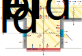

# PALM-SLUrb Module Reference

## Overview

PALM-SLUrb (PALM's Single-Layer Urban canopy model) is a physics-based urban surface model for non-resolved urban canopies. The model can be used to parametrize online surface fluxes from urban surfaces in PALM for simulations where individual obstacles (e.g. buildings) and the flow around them cannot be resolved at the selected grid resolution. Its purpose is to provide a relatively simple yet physically based method to model urban surface fluxes in PALM in cases where resolving tee flow within urban canopies in detail is not a priority. Such use cases would include e.g. mesoscale urban studies or coarser resolution domains in nested setups. The fluxes are computed online during the simulation, with two-way online coupling to the atmospheric (LES/RANS) simulation.

The model is currently considered **experimental**, and the users are recommended to carefully check and evaluate the results in their use case.

[Link to SLUrb's user guide](../../../../../Guide/LES_Model/Modules/Surface/SLUrb)

### Main features

* Energy balance scheme for generalised urban morphology, modelling radiative fluxes, as well as sensible, latent and conductive heat fluxes.
* Prognostic equation for street canyon air temperature and humidity.
* Transfer model for energy and momentum based on a resistance network.
* Two-way online coupling with the atmospheric LES/RANS simulation.
* Parametrised shading and reflections of long and shortwave radiation within the urban canopy with coupling to atmospheric radiation models.
* Partial transmission of shortwave radiation through window layers.
* Moist physical processes: evaporation, dewfall, precipitation interception and runoff.
* Possibility for anisotropic street canyons (specified street orientation).
* Mixed urban–natural tiles are realised by aggregating fluxes from SLUrb and PALM’s land surface model (PALM-LSM), weighted by urban fraction.
* Possibility for hybrid nested setup where urban canopies are modelled with SLUrb in coarser resolution domains and explicitly resolved in high-resolution domains.
* Input of user-defined surface parameters through a netCDF I/O interface.
* Instantaneous and temporally averaged output of model variables and a range of additional diagnostic quantities through the netCDF I/O interface.

## Model description
This technical documentation provides only a brief overview of the model, omitting some implementation details. For a comprehensive model description, you may refer to a preprint of the SLUrb model description and evaluation paper:  
[Karttunen et al.: PALM-SLUrb v24.04: A single-layer urban canopy model for the PALM model system – Model description and first evaluation, Geosci. Model Dev. Discuss [preprint], https://doi.org/10.5194/gmd-2024-235, in review, 2024.](https://doi.org/10.5194/gmd-2024-235)

### Overview
SLUrb is a resistance-based single-canyon model based on the physical formulation of the [Town Energy Balance (TEB) model](https://opensource.umr-cnrm.fr/projects/teb) (Masson V., 2000 and subsequent papers). However, no codebase is shared between SLUrb and TEB, and SLUrb. Numerical schemes of SLUrb are similar to those of PALM's land surface model (LSM) and urban surface model (USM). The atmosphere-surface coupling scheme is specifically developed for PALM. Mixed urban-natural tiles are realised using aggregated fluxes from SLUrb and LSM, weighted by urban fraction.

The urban surface is modelled with a infinite two-dimensional street canyon assumption, as represented by a cross-section figure below. SLUrb uses six prognostic surfaces: roof, wall A, wall B, window A, window B and road. Walls and windows A and B are located on opposite sides on the street canyon. Walls (and windows) A and B recieve different amount of direct solar radiation depending on the street canyon orientation (input by the user) and time of day. Alternatively, the user may opt to use isotropic street canyons where walls A and B are represented by one singular wall integrated over all solar angles. In addition to the prognostic equations for surfaces, SLUrb has an internal street canyon model to model the atmospheric conditions within it.

Unlike TEB, SLUrb solves additional prognostic equations for $T_{can}$ and $q_{can}$. This change to the model formulation was required to stabilize the solution even in highly turbulent flows, where the conditions at the first atmospheric grid level may rapidly change due to resolved-scale turbulence.

As SLUrb is a single-layer model, the thermodynamical quantities for walls, windows and the street canyon air are representative of those at canyon half-height ($H_{avg}/2$).

Fig. 1: An overview of the physical processes included in PALM-SLUrb, where $\tau$ represents parametrised momentum fluxes, $L$ longwave radiative, $H$ sensible heat, $LE$ latent heat and $G$ conductive heat fluxes respectively. The modelled resistance network is illustrated with zigzag lines. The surfaces are illustrated with the default four material layers.

### Surface energy balances
The surface energy balance equation SLUrb solves for each surface, written in general form for a given surface indicated with $\star$, is defined as

$$
C_{0,\star},\frac{\partial T_{0,\star}}{\partial t} = S^\Updownarrow_\star + L^\Updownarrow_\star - H_\star - LE_\star - G_{0,\star},
$$

where $T_{0,\star}$ is the temperature of the material layer closest to the surface, $C_{0,\star}$ is its heat capacity, $S^\Updownarrow_\star$ and $L^\Updownarrow_\star$ are the net shortwave and longwave radiation budgets modelled by an internal canopy radiation model, $H_\star$ is the surface sensible heat flux, $LE_\star$ the surface latent flux and $G_{0,\star}$ the conductive heat flux to the second material layer. To model subsurface heat conduction, a one-dimensional discrete heat diffusion equation is solved for subsurface temperatures $T_{k,\star}$, where $k>0$ is the index of the subsurface layer. $LE_\star$ is only considered for horizontal surfaces, i.e. roofs and roads. For walls and windows, $LE_\star$ is omitted from the surface energy balance. Both sensible and latent fluxes are computed between the surface and a reference point, the reference point being the first atmospheric model level for roofs, and canyon midpoint for walls, windows, and roads.

Furthermore, SLUrb considers by default four material layers for each surface, allowing for representation of subsurface heat transfer. By defining the material temperatures at layer centres and fluxes defined at layer edges, the discretised conductive heat flux between a given subsurface layer $n$ ($n \neq 1$) and the next layer $n+1$ is

$$
\begin{aligned}
    G_{n,\star} &= \frac{2}{\Delta z_{n,\star} / \lambda_{n,\star} + \Delta z_{n+1,\star} / \lambda_{n+1,\star}} \left(T_{n,\star} - T_{n+1,\star}\right)\\
    &=\Lambda_{n,\star} \left(T_{n,\star} - T_{n+1,\star}\right),
\end{aligned}
$$

where $\Delta z_n$ and $\Delta z_{n+1}$ are the layer thicknesses, $\lambda_n$ and $\lambda_{n+1}$ are the heat conductivities of the layers and $\Lambda_{n,\star}$ is the layer edge conductivity. Subsequently, the prognostic equation for a subsurface layer $n$ temperature is

$$
\frac{\partial T_{n,\star}}{\partial t} = \frac{1}{C_{n,\star}\Delta z_{n,\star}} \left( G_{n-1,\star} - G_{n,\star}  \right),
$$

For numerical solution, the energy balances are linearized in time and solved with the explicit RK3 time integration scheme.

### Radiation
SLUrb implements an internal radiation model to parametrize the radiative interactions such as shading and reflections within the urban canopy. Hence, the radiation model used for the atmospheric simulation is not used within the urban canopy as modelled by SLUrb. However, the top-of-canopy radiative fluxes are fullu coupled with the PALM's radiation schemes (see [radiation_scheme](../../../Namelists/#radiation_parameters--radiation_scheme)). Currently, `clear-sky`, `external`, `constant` and `rrtmg` are supported. Allthough in the case of SLUrb RTM will not used to resolve radiation interactions within the urban canopy, it can be used in simulations with SLUrb to resolve e.g. shadows due to complex terrain.

For shortwave radiation balance in anisotropic street canyons, analytical solution of net radiative flux on surfaces by Lemonsu et al. (2012) after infinite reflections within the street canyon is used. For isotropic canyons, the original parametrization by V. Masson (2000) is used, with the addition of windows. Window transmissivity is modelled as in the PALM-USM model.

The longwave radiation interactions are modelled after Johnson et al. (1991), with first order reflections resolved within the street canyon. The first order reflections contribute around 5% of the total LW budget, while higher order reflections would contribute only <0.5%. The interaction coefficients are computed during initialization and stored in memory in order to save computation time during simulation. Furthermore, the longwave radiation interactions are linearized around surface temperature for usage in the RK3 time integration scheme.

### Canyon model
SLUrb solves prognostic equations for canyon air temperature $T_{\mathrm{can}}$ and specific humidity $q_{\mathrm{can}}$. A finite volume of canyon air with a total volume of $h_{\mathrm{bld}}$ per unit area is considered, leading to the following prognostic equations:

$$
\begin{align*}
    \frac{\partial T_{\mathrm{can}}}{\partial t} &= \frac{1}{\rho_a C_{da,p}, h_{\mathrm{bld}}} \left( H_{\mathrm{s,can}} - H_{\mathrm{can}}\right), \\
    \frac{\partial q_{\mathrm{can}}}{\partial t} &= \frac{1}{\rho_a L_v, h_{\mathrm{bld}}}  \left( LE_\mathrm{road} - LE_\mathrm{can} \right),
\end{align*}
$$

where $H_{\mathrm{can}}$ and $LE_{\mathrm{can}}$ are the sensible and latent heat fluxes from canyon air to atmosphere respectively, and $H_{\mathrm{s,can}}$ is the aggregated sensible heat flux from the canyon surfaces defined as

$$
H_{\mathrm{s,can}} = \left( 1 - \mathcal{A}_{\mathrm{win}} \right)  \frac{h_\mathrm{bld}}{w_\mathrm{can}} \left( H_\mathrm{wall,A} + H_\mathrm{wall,B} \right) + \mathcal{A}_{\mathrm{win}} \frac{h_\mathrm{bld}}{w_\mathrm{can}} \left( H_\mathrm{win,A} + H_\mathrm{win,B} \right) + H_\mathrm{road} + H_\mathrm{traffic}.
$$

In SLUrb, the wind within the urban canopy is not resolved by the atmospheric model, but represented by parametrized wind speed at canyon half-height. By default, it is computed following Lemonsu et al. (2004), extending the original Masson (2000) parametrisation into wake interference and isolated roughness flow regimes of shallow canyons ($h_{\mathrm{bld}}/w_{\mathrm{canyon}}<1$):

$$
U_{\mathrm{canyon}} = \mathcal{D}_{w}\exp\left( - \frac{1}{4} \frac{h_{\mathrm{bld}}}{w_{\mathrm{canyon}}} \right) \frac{\ln \left( \frac{h_{\mathrm{bld}}/3}{z_{0,\tau,\mathrm{urban}}} \right)}{\ln \left( \frac{\mathbf{\Delta}_z/2 + h_{\mathrm{bld}}/3}{ z_{0,\tau,\mathrm{urban}} } \right)} U_1,
$$

where $U_1$ is the wind speed at the first atmospheric model level, and

$$
\mathcal{D}_w = \max\left\{\min\left[ 1 + 2 \left(\frac{2}{\pi} - 1\right) \left( \frac{h_{\mathrm{bld}}}{w_{\mathrm{canyon}}} -\frac{1}{2} \right), \; 1 \right], \frac{2}{\pi} \right\}.
$$

Alternatively, the original form of Masson (2000) or a different parametrization by Krayenhoff & Voogt (2007) may be utilized.

### Resistance model
For aerodynamic resistances for transport in vertical direction, i.e. surface resistances of roofs and roads as well as the resistance between canyon air and the first PALM atmospheric model level, Monin-Obukhov similarity theory is utilised. The general form is

$$
r_{H,\star} = \frac{1}{\kappa u_{*}} \left[ \ln\left( \frac{\Delta_{\mathrm{MO}}}{z_{0,\tau,\star}} \right) - \Psi_H \left( \frac{\Delta_{\mathrm{MO}}}{L_{\mathrm{MO}}} \right) + \Psi_H\left( \frac{z_{0,H,\star}}{L_{\mathrm{MO}}} \right) \right],
$$

where $\Delta_{\mathrm{MO}}$ is the distance to a reference level, $u_*$ is the local friction velocity at a reference level, $z_{0,\tau}$ is the local aerodynamic roughness length for momentum, $\Psi_H$ an integrated universal stability function for heat and $L_{\mathrm{MO}}$ the local Obukhov length. The Obukhov length is solved  every time step using an iterative method described in Maronga et al. (2020).

For resistance for transport in horizontal direction, i.e. surface resistances of walls and windows, three options are available. The default is the DOE-2 parametrization from EnergyPlus building energy simulation program. The parametrisation takes into account natural convection along the facades and forced convection due to canyon wind. It is calculated in SLUrb as an average of wind- and leeward facades:

$$
r_{H,\star,\text{DOE-2}}=  \frac{C_{da,p}\rho_a}{\sqrt{\mathcal{D}_n^2+ \frac{1}{2} \left[\left( a_1 U_{\mathrm{can,eff}}^{b_1} \right)^2 + \left( a_{2} U_{\mathrm{can,eff}}^{b_2}\right)^2 \right]}},
$$

where $\mathcal{D}_n=1.31\left| T_{0,\star} - T_{\mathrm{canyon}} \right|^{\frac{1}{3}}$ is a component representing natural convection with model constants $a_1=3.26~\mathrm{W}~\mathrm{m}^{-2}~\mathrm{m}^{-b_1}~\mathrm{s}^{b_1}$ and $b_1=0.89$ for windward facades, and $a_2=3.55~\mathrm{W}~\mathrm{m}^{-2}~\mathrm{m}^{-b_2}~\mathrm{s}^{b_2}$ and $b_2=0.617$ for leeward facades.

Other available options are parametrisations following Krayenhoff & Voogt (2007) and Rowley (1932).

### Implementation and model coupling
Each time step SLUrb computes a solution for the set of prognostic variables ($T_{\mathrm{can}}$, $q_{\mathrm{can}}$, $T_{k,\mathrm{roof}}$, $T_{k,\mathrm{wall,A}}$, $T_{k,\mathrm{wall,B}}$, $T_{k,\mathrm{win,A}}$, $T_{k,\mathrm{win,B}}$, $m_{\mathrm{roof},\mathrm{liq}}$, $m_{\mathrm{road},\mathrm{liq}}$) that fulfils the energy balance up to the accuracy of numerical schemes ($10^{-3}\dots 10^{-6}~\mathrm{W}~\mathrm{m}^{-2}$ depending on e.g. the time step of atmospheric radiation model). For the atmospheric coupling, roof and canyon heat fluxes are aggregated to total urban tile heat fluxes as

$$
\begin{align*}
    &H_\mathrm{urban} = \mathcal{A}_p H_\mathrm{roof} + \left( 1 -\mathcal{A}_p \right) H_\mathrm{can}, \\
    &LE_\mathrm{urban} = \mathcal{A}_p LE_\mathrm{roof} + \left( 1 -\mathcal{A}_p \right) LE_\mathrm{can}.
\end{align*}
$$

The friction velocity is computed for the urban surface as a whole following MOST and using representative urban roughness length:

$$
u_{*,\mathrm{urban}} = \kappa U_{1,\mathrm{eff}} \left[ \ln\left( \frac{\Delta_z/2}{z_{0,\tau,\mathrm{urban}}} \right) - \Psi_m \left( \frac{\Delta_z/2}{L_\mathrm{MO}}\right) +\Psi_m \left(  \frac{z_{0,\tau,\mathrm{urban}}}{L_\mathrm{MO}} \right) \right]^{-1},
$$

after which the total momentum flux is computed separately for the horizontal wind components as

$$
\tau_{i,\mathrm{urban}} = -\rho_a u_i u_{*,\mathrm{urban}} \left[ \ln\left( \frac{\Delta_z/2}{z_{0,\tau,\mathrm{urban}}} \right) - \Psi_m \left( \frac{\Delta_z/2}{L_\mathrm{MO}}\right) +\Psi_m \left(  \frac{z_{0,\tau,\mathrm{urban}}}{L_\mathrm{MO}} \right) \right]^{-1},
$$

and entered as a tendency in the respective prognostic equation. Furthermore, urban fraction is used to aggregate these heat fluxes with the fluxes modelled by LSM (vegetation or water surfaces) for the same surface grid cell in a mixed-tile mosaic approach. The tile-aggregated fluxes enter the atmospheric prognostic equations as tendencies at the first atmospheric $u$-grid level above topography in PALM's Arakawa C-grid through PALM's subgrid-scale diffusion routines. The modelling, aggregation, and coupling is performed at every substep of the time integration scheme.

For coupling to atmospheric radiation models in PALM, effective urban albedo

$$
\alpha_\mathrm{urban}=\frac{S^\Uparrow_\mathrm{urban}}{S^\Downarrow_\mathrm{urban}},
$$

effective urban emissivity aggregated using surface-to-sky view factors

$$
\epsilon_\mathrm{urban} = \mathcal{A}_p \epsilon_\mathrm{roof} + \left( 1 - \mathcal{A}_p \right) \left( \mathcal{F}_\mathrm{road} \epsilon_\mathrm{road} +  \frac{h_\mathrm{bld}}{w_\mathrm{can}} \mathcal{F}_\mathrm{fac} \epsilon_\mathrm{fac} \right),
$$

and urban radiative temperature

$$
T_{\mathrm{rad},\mathrm{urban}}=\left( \frac{L^\Uparrow_\mathrm{urban}}{\sigma \epsilon_\mathrm{urban}}\right)^\frac{1}{4},
$$

are computed.

## References
Johnson, G. T., T. R. Oke, T. J. Lyons, D. G. Steyn, I.D. Watson and J. A. Voogt (1991): Simulation of surface urban heat islands under ‘IDEAL’ conditions at night part 1: Theory and tests against field data, Bound.-Lay. Meteorol, 56, 275-294

Kanda, M., M. Kanega, T. Kawai, R. Moriwaki, and H. Sugawara (2007): Roughness Lengths for Momentum and Heat Derived from Outdoor Urban Scale Models, J. Appl. Meteorol. Climatol., 46(7), 1067-1079

Karttunen, S., M. Sühring, E. O'Connor, and L. Järvi (2024): PALM-SLUrb v24.04: A single-layer urban canopy model for the PALM model system – Model description and first evaluation, Geosci. Model. Dev. Discuss.

Krayenhoff, E. S., J. A. Voogt (2007): A microscale three-dimensional urban energy balance model for studying surface temperatures,  Bound.-Lay. Meteorol, 123, 433-461

Lemonsu, A., C. S. B. Grimmond, and V. Masson (2004): Modeling the Surface Energy Balance of the Core of an Old Mediterranean City: Marseille, J. Appl. Meteorol., 43(2), 312-327

Lemonsu, A., V. Masson, L. Shashua-Bar, E. Erell, and D. Pearlmutter (2012): Inclusion of vegetation in the Town Energy Balance model for modeling urban green areas, Geosci. Model Dev., 5, 1377-1393

Maronga, B., and Coauthors (2020): Overview of the PALM model system 6.0, Geosci. Model. Dev., 13, 1335-1372

Masson, V. (2000): A Physically-Based Scheme for the Urban Energy Budget in Atmospheric Models, Bound.-Lay. Meteorol, 94, 357-397

Masson, V., C. S. B. Grimmond, and T. R. Oke (2002): Evaluation of the Town Energy Balance (TEB) Scheme with Direct Measurements from Dry Districts in Two Cities, J. Appl. Meteor. Climatol., 41, 1011–1026

Pigeon G., K. Zibouche, B. Bueno, J. Le Bras, and V. Masson (2014): Improving the capabilities of the Town Energy Balance model with up-to-date building energy simulation algorithms: an application to a set of representative buildings in Paris. Energy and Build., 76, 1–14

Rowley F. B., and W.A. Eckley (1932): Surface coefficients as affected by wind direction. ASHRAE Trans., 38, 33–46
