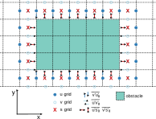
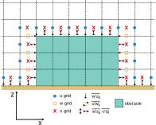

# Cut-Cell Topography Reference

## Overview

The implementation of a cut-cell topography into PALM is primarily motivated in terms of an accurate representation of the surface energy balance.
With a Cartesian representation of topography based on an immersed boundary method where a grid cell is either 100\% fluid or 100\% obstacle (Briscolini and Santangelo, 1989), surfaces are approximated by step-like rather than slanted surfaces.
As a consequence, the total area of the surface may be artificially increased by step-like surfaces with different orientation than for the slanted surfaces. In terms of the flow dynamics, the flow is considered to be only marginally affected and additionally produced turbulence due to the ragged surface structure on the grid scale is assumed to quickly dissipate as tests show.  However, in terms of urban radiation transfer and the surface energy balance, systematic errors might emerge due to the change of surface orientation and surface area increase, which in turn may impact the entire surface energy balance of an urban area.
Hence, in order to improve the surface representation in PALM, a so-called cut-cell method is implemented, where a step-like surface approximation is replaced by continuous planes that lie within the Cartesian grid, thereby permitting some grid cells to be cut by the terrain and building surfaces (Good et al., 2014; Shaw and Weller, 2016).

This technical documentation provides a brief overview of the technical realization. A more comprehensive model description is currently under preparation and will be publicly available as a peer-reviewed journal article in the future.

## Technical Realization in PALM

In the following, a description of the cut-cell surface representation in PALM will be given, with particular focus on the interaction between model surfaces and the atmosphere. Before this will be described in detail, the current state of the surface representation on a step-like surface approximation will be outlined, as this builds the basis for the changes required for the cut-cell representation. Finally, the treatment in the radiative transfer model (Krč et al., 2021) is outlined.

**Some Aspects of Topography Representation**

PALM solves the momentum and balances equations of various scalars on an Arakawa-C grid (see Maronga et al., 2015, Fig. 2), where scalar quantities are defined at the grid-cell center and the velocity components are staggered by half a grid spacing on the grid-cell boundaries.
Grid points can be classified into 3 categories: (i) topography grid points where no prognostic equation is effectively solved, (ii) fluid grid points bounded by a surface and (iii) fluid grid points without any adjacent surfaces (see Maronga et al., 2015, Fig. 4).
For surface-bounded grid cells additional code is required, e.g., for calculating the surface shear stress, to set boundary conditions, or for the solution of the surface energy balance (Maronga et al., 2020).
With a Cartesian topography, a fluid grid cell can be bounded by multiple walls (as illustrated in Fig. 1), while each discrete wall defines a surface element in PALM, i.e. the total number of model surfaces corresponds to the number of grid-cell faces covered by a wall.
With this Cartesian topography approximation, the wall lies directly at the grid-cell face and the surfaces exhibit a discrete orientation, aligned normal to the $x$, $y$ or $z$ axis, internally referred to as westward-, eastward-, northward-, southward-, upward- or downward-facing surface, respectively, assuming that the model $x$, $y$ and $z$ axis correspond to the cardinal directions.
For each discrete surface element information is stored about the grid indices of its reference fluid grid point, its orientation expressed by the normalized normal vector, its type (i.e. if it is a building or a natural-like surface), as well as further attributes describing physical properties.
With a step-like topography a grid cell is either fully obstacle or fully atmosphere, as illustrated in Fig 1. This implies that model surfaces coincide with the grid faces, surface fluxes are normal to the surface, and the distance between the prognostic grid point and the surface is $0.5\,dx_\mathrm{i}$.

{width=50%}

**Fig. 1:** Illustration of the topography representation in a Cartesian framework. The thick black line indicates the step-like approximation of the topography surface in the Cartesian framework. The gray squares indicate the grid point center, while the red dots indicate the location of the surface. $\mathrm{d}_\mathrm{l}, \mathrm{d}_\mathrm{r}, \mathrm{d}_\mathrm{t}, \mathrm{d}_\mathrm{d}$ indicate the distance between the grid center and the location where the flux is defined, respectively.

**Fig. 2:** Illustration of the topography representation in a Cartesian framework in a $x-y$ cross-section. The colored arrows mark the location of fluxes for the different prognostic quantities on the staggered grid, with red indicating scalar fluxes, dark-blue, light blue and orange momentum fluxes considered in the prognostic equation of $u$, $v$ and $w$, respectively.

**Fig. 3:** Illustration of the topography representation in a Cartesian framework in a $x-z$ cross-section. The colored arrows mark the location of fluxes for the different prognostic quantities on the staggered grid, with red indicating scalar fluxes, dark-blue, light blue and orange momentum fluxes considered in the prognostic equation of $u$, $v$ and $w$, respectively.

In case of Cartesian geometry, one fluid grid cell may interact with more than one surface element as indicated by the center grid box in Fig. 1. Further, each surface element is adjacent to exactly one atmospheric grid cell, which forms a $1:n$ relationship for the Cartesian topography, where one surface interacts with exactly one grid point but one atmospheric grid cell might be affected by $n$ surfaces that all refer to the same atmosphere information from that prognostic grid point.
For each of the $n$ surfaces, the surface scalar and momentum fluxes are calculated, which later enter the corresponding prognostic equation as surface boundary condition. As boundary conditions for the momentum equations, the surface shear stress needs to be calculated for each surface element.
In PALM, the shear stress is calculated according to Monin-Obukhov similarity theory (MOST, for a detailed description we refer to Maronga et al., 2020), where the wall-normal gradient of the surface-parallel velocity at the first grid point outside of the topography is set in relationship to the surface flux under consideration of the stability as well as the surface roughness. Here, we note that stability functions are only considered for upward-facing surfaces and are ignored for any other surface orientation.
Figure 2 and 3 illustrate the location of surface fluxes and its relation to the prognostic fluid grid points along the $x-y$ and $x-z$ plane, respectively.
Also, boundary conditions for the scalar quantities are required at the surfaces. Depending on the considered scalar quantity, fluxes can be  either described or, in particular for the fluxes of sensible and latent heat, computed by the so-called energy-balance solvers (include link to LSM and USM) for natural-like surfaces (Gehrke et al., 2021) or building surfaces (Resler et al., 2017). Depending on the orientation of the surface, different physical material properties can be assumed for building surfaces, controlling the partitioning of the received radiation energy into its components, where upward-facing surfaces are considered as roof surfaces while any other oriented surfaces are considered as facade surfaces. For natural surfaces, no distinction is made between different surface orientations. Even though natural-like surfaces appear rarely in a step-like manner in reality, also natural-like surface like shortly-vegetated surfaces, bare soil surfaces or even water surfaces are treated in a step-like manner, where also at the vertical wall an energy-balance is solved in the Cartesian topography representation.

**Atmosphere-Surface Representation with a cut-cell approach**

{width=50%}

**Fig. 4:** Illustration of the topography representation in a cut-cell framework in a $x-z$ cross-section. The gray squares indicate the scalar grid point at the cell center, while the thin lines indicate the grid cell faces. The red circles indicate the interception point of a line between two grid points, while the indicate $\mathrm{d}_\mathrm{l}$, $\mathrm{d}_\mathrm{r}$, $\mathrm{d}_\mathrm{d}$ and $\mathrm{d}_\mathrm{t}$ indicate the distance between the prognostic grid point location and the location where the flux is defined for the left-, right-, down- and top-sided flux, respectively. The thick black line marks the surface as considered in the model. The green-colored numbers indicate the surface-element number, while the black-colored number indicates the number of the fluid grid points. Further on, the considered normal vector for surface 1 and its respective components is illustrated. Moreover, the triangles mark the location of the $u-$grid. Please note, for the sake of readability, not every $u-$grid point is marked.

With a cut-cell representation the surfaces do not necessarily coincide with the grid-cell faces anymore and the distance between the prognostic grid point and the surface can be different, as illustrated in Fig. 4. Also the surface can be orientated differently. In order to consider this for the surface-boundary representation in PALM, multiple adjustments need to be made which are outlined in the following.

With a cut-cell representation, in contrast to a step-like approximation, a single surface element can theoretically interact with multiple atmospheric cells ($m$), while an atmospheric cell can still interact with different surfaces ($n$), forming an $m:n$ relationship as illustrated in Fig. 4, where surface 1 would actually interact with the prognostic grid points 1 and 2. However, this would imply that a given surface temperature (also momentum and other variables) is affected by two fluid grid points, while the resulting surface flux is feed-back to both prognostic fluid grid points. Thus, the flux-gradient relationship between the surface and the prognostic fluid grid point is not unambiguously defined anymore, potentially resulting in numerical instabilities.
To avoid this, we assume that a surface within a grid box can be represented by multiple atmosphere-surface relationships, e.g. between surface 1 (green-colored number) and grid point 1 (black-colored number) or between surface 1 and grid point 2, as indicated in Fig 4.. Each atmosphere-surface relationship is then represented by a given model surface similar to the Cartesian representation, while the atmosphere-surface distance and the normal vector at the interception point (red circle in Fig. 4) are defined separately for each model surface.
Summarized, for each atmospheric cell that is blocked along one of the $x,y,z$-directions, it is necessary to locate a corresponding surface element in that direction, the distance between the prognostic grid location and the interception point, as well as the corresponding normal vector of the surface, while the resulting surface flux is weighted by the corresponding normal vector component. This establishes the mutual relation between surface-affected atmospheric cells and cut-cell represented surface elements which can be embedded in a Finite difference model. For instance, in case of a scalar flux, surface 1  defines a flux that is considered as surface boundary condition for the prognostic grid point 1 and 2 , while the considered flux is weighted with the corresponding normal vector components $n_3$ and $n_1$ at grid point 1 and 2, respectively.

**Numerical Representation of the atmosphere-surface relationship in a Cut-Cell Framework**

In the model, surface scalar fluxes enter the balance equation of a scalar $s$ via the subgrid-scale term $\frac{1}{\rho}\,\frac{\partial \rho\,\overline{u"_j s"}}{\partial x_j}$, with $\rho$ being the air density, $u_j$ the velocity components and the overbar indicates filtered variables (see Maronga et al., 2020). At non-bounded grid-cell faces, the subgrid scale scalar flux $F_\mathrm{s} = \rho\overline{u"_j s"}$  is expressed by

$F_\mathrm{s} = -K_\mathrm{h}\,\frac{\partial\,\overline{s}}{\partial x_i}\,,$

with $K_\mathrm{h}$ being the diffusion coefficient of for heat, while at surface-bounded grid faces the surface scalar flux is either prescribed or results from one of the energy-balance solvers. The subgrid-scale term is then approximated by the divergence of the fluxes

$\frac{1}{\rho}\,\frac{\partial \rho\,\overline{u"_j\,s"}}{\partial x_j} = \frac{1}{\rho}\,\frac{n_{j+\frac{1}{2}}F_\mathrm{s}^{+} - n_{j-\frac{1}{2}}\,F_\mathrm{s}^{-} }{d}\,,$

with $d$ being the distance between the two considered fluxes. In case of the Cartesian step-like topography represenation $d$ equals the corresponding grid spacing $\Delta x_i$ and the fluxes are located strictly at the grid-cell faces, while in case of the cut-cell approach $d = d_{+} + d_{-}$ (see Fig. 4), describing the distance between the prognostic grid point and the flux location, i.e. the interception point with surface or the grid-cell face. At non-surface-bounded grid points $d_{\pm} = 0.5\,\Delta x_i$. With this distance weighting of the fluxes, the exact location of the surface is considered. Further, $n_{\pm\frac{1}{2}}$ indicates the respective normal-vector weighting of the flux at the given flux location, which guarantees that the considered flux emerging from a surface is not overweight. At non-surface-bounded locations $n_{\pm\frac{1}{2}} = 1$, while at surface locations $n_{\pm\frac{1}{2}}$ represents the corresponding normal vector component of the surface as mentioned above. (In the Cartesian step-like topography represenation, $n_j$ is either 1 or -1.)

For the staggered velocity components, which are defined at the grid cell faces, the corresponding distance between the respective grid point location and the interception point with the surface along the blocked direction as well as the corresponding normal vector at this location are computed and stored separately. For each surface-bounded staggered $u$, $v$ and $w$ grid point, surface boundary conditions for the respective momentum fluxes are required, which are calculated via MOST using the absolute value of the surface-parallel velocity at the first grid point adjacent to the surface. To compute the surface parallel velocity we make use of the normal vector of the adjacent surface. The flow vector $\vec{u}$ can be split into a surface-parallel and a surface-normal part with

$\vec{u} = \vec{u_\parallel} +  \vec{u_\perp}\,.$

Per definition, the surface-parallel component of the flow is perpendicular to the surface normal direction, i.e. the dot product of

$\vec{u_\parallel}\,\cdot\,\vec{n} = 0\,,$

while the dot product

$\vec{u_\perp}\,\cdot\,\vec{n} = \lambda\, ,$

with $\lambda$ being a scaling parameter. From this, we obtain the surface-parallel part as

$\vec{u_\parallel} = \vec{u} - \lambda\,\vec{n}$.

To obtain $\lambda$, we multiply with $\vec{n}$, which leads to

$\vec{n}\,\cdot\,\vec{u_\parallel} = \vec{n} \cdot ( \vec{u} - \lambda \vec{n} )\,,$

$0 = \vec{n} \cdot \vec{u} - \lambda \vec{n} \cdot \vec{n}\,,$

$\lambda = \frac{ \vec{n} \cdot \vec{u} }{\vec{n} \cdot \vec{n}} = \vec{n} \cdot \vec{u}\,.$

As the dot product of $\vec{n} \cdot \vec{n} = 1$, we can obtain the surface-parallel part from

$\vec{u_\parallel} = \vec{u} - (\vec{n} \cdot \vec{u}) \vec{n}\,.$

From this surface-parallel flow component we compute the friction velocity $u_\ast$ and the resulting surface fluxes $<u'_i\,u'_j>_0$ as indicated in Fig. 2 and 3 (see also in Maronga et al., 2015). These computed surface fluxes are then used as surface boundary condition for the momentum equations, while the distance between the location of the surface flux and the prognostic grid point is given by $d_{\pm}$ in the cut-cell topography representation and always half a grid spacing in the Cartesian topography representation.

Equivalent to the surface scalar fluxes, the resulting surface momentum fluxes are weighted with the corresponding normalized normal vector component of the surface for the relevant blocked Cartesian direction too, while also the location of the surface with respect to the staggered prognostic grid point is considered via the corresponding distance.
One exception is made for prognostic grid points located close to the surface with a distance to the surface < $z_0$ (roughness length), where MOST cannot be applied anymore. This case, the surface momentum fluxes are calculated based on the atmosphere information of the neighboring grid point.
Furthermore, as mentioned above, at upward-facing surfaces (in the Cartesian topography) the effect of stability is considered in MOST. This results from the consideration that stability effects are governed by the buoyancy force, which acts along the vertical direction. In the case of the cut-cell method, the decision whether stability is considered for the computation of the friction velocity and associated surface-fluxes or not is not straightforward anymore.
Hence, we decided to consider stability functions for surfaces tilted $\le\,30^\circ$ to a $x,y$-plane. For surfaces tilted $\gt\,30^\circ$ to a $x,y$-plane, stability functions are not considered equivalent to vertical walls in the Cartesian topography representation.¸

**Some technical aspects concerning atmosphere-surface representation**

In the Cartesian topography representation, surface scalar and momentum fluxes are stored together in dedicated Fortran data structures named ``surf_def, surf_lsm, surf_usm``, depending on its classification into default-type, natural-type (land-surface model) or urban-type (building-surface model), respectively. In the cut-cell representation, where the number of surface-atmosphere relationships on the staggered $u,v,w$-grid can deviate from the number of surface-atmosphere relationships on the scalar grid, surface momentum fluxes are calculated and stored on separate data structures named ``surf_u, surf_v, surf_w``, while scalar fluxes are still stored on ``surf_def, surf_lsm, surf_usm``.

**Active and Inactive Cut-Cell Surfaces**

{width=50%}

**Fig. 5:** Illustration of active and inactive energy-balance surfaces. The thick solid black line indicates the location of the surface within the numerical grid. The dashed black lines and associated black numbers indicate the connection between prognostic grid points and active surfaces where surface fluxes are considered. The green-colored numbers mark the number of all considered surface elements in the RTM. Further on, the dashed blue lines indicate the connection between inactive energy-balance surfaces and the adjacent prognostic grid points.

In the Cartesian topography representation, the surface is approximated in a step-like manner, while each horizontal and vertical surface interacts with exactly one prognostic grid point (as illustrated in Fig. 1). This is not the case anymore with a cut-cell representation, as illustrated in Fig. 5, where some surfaces interact with prognostic grid points (surfaces 1, 3 and 4), while other surfaces do not interact with prognostic grid points (surfaces 2 and 5). This case, the terrain and building surfaces are distributed among $n_\mathrm{surf}$ grid boxes, while each grid cell that is cut by the surface defines a separate surface element in the model identified by the corresponding grid indices $k,j,i$ for that grid cell.
Thus, surfaces can be separated into active and inactive surfaces in terms of a mutual feedback to the prognostic grid.
In case no radiative transfer and energy-balance model is utilized and surface fluxes for latent and sensible heat are prescribed (i.e. default-type surfaces), inactive surfaces are simply ignored. However, in case of radiative transfer, also inactive surfaces become relevant as they participate in the radiative transfer process and require surface attributes describing its physical properties, surface temperature and surface radiation balance components.

Active cut-cell surfaces are stored in the dedicated surface types ``surf_def, surf_lsm, surf_usm``. However, the radiative transfer model requires the entire set of cut-cell surfaces compassing active and inactive to assure a closed and watertight surface envelope. Thus, active and inactive surfaces are further summarized in a dedicated data structure name ``surf_cutcell``, where all relevant information for the radiative transfer model (Krč et al., 2021) for all surfaces is stored on, i.e. surface temperature, surface emissivity and albedo, as well as the radiation balance components. Each time the radiative transfer model is invoked, data needs to be exchanged between the active cut-cell surfaces stored on ``surf_lsm`` or ``surf_usm`` and ``surf_cutcell``. ``surf_cutcell`` is exclusively used to represent the radiation exchange between surfaces. For inactive surfaces emissivity and albedo are set according to its general classification, while surface temperature is taken from the closest active surface element store in ``surf_lsm`` or ``surf_usm``, assumed to be a reasonable proxy. After the radiation transfer has been finished, data concerning the radiation balance components is transferred back to ``surf_lsm`` and ``surf_usm``, correspondingly.
A further description of the cut-cell representation in the radiative transfer model is given further below.

**Data Input**

In order to prescribe the surface in the cut-cell representation, dedicated input data is required in the [static input file documentation](../../../IO-Files/Drivers/static). This compasses geometrical information about the surface such as the coordinates of the mass center ([cct_face_center](../../../IO-Files/Drivers/static/#static--variable--cct_face_center)), the normal vector ([cct_face_normal_vector](../../../IO-Files/Drivers/static/#static--variable--cct_face_normal_vector)), the surface area per grid cell ([cct_face_area](../../../IO-Files/Drivers/static/#static--variable--cct_face_area)), the vertices cutting the edges of a grid box ([cct_vertices_per_face](../../../IO-Files/Drivers/static/#static--variable--cct_vertices_per_face)) as well as the corresponding grid indices in the numerical grid where the cut-cell surface is located ([cct_3d_grid_indices](../../../IO-Files/Drivers/static/#static--variable--cct_3d_grid_indices), ordered $k,j,i$). Further on, for each cut-cell surface its general classification is required given by [cct_surface_type_classification](../../../IO-Files/Drivers/static/#static--variable--cct_surface_type_classification) (natural-type: 0, building wall: 1, building roof: 2, default-type: 3). To further classify the cut-cell surface, information about its [cct_vegetation_type_classification](../../../IO-Files/Drivers/static/#static--variable--cct_vegetation_type_classification), [cct_water_type_classification](../../../IO-Files/Drivers/static/#static--variable--cct_water_type_classification), [cct_pavement_type_classification](../../../IO-Files/Drivers/static/#static--variable--cct_pavement_type_classification), [cct_building_type_classification](../../../IO-Files/Drivers/static/#static--variable--cct_building_type_classification), and its [cct_building_id_classification](../../../IO-Files/Drivers/static/#static--variable--cct_building_id_classification) needs to be given.

To prepare cut-cell input, the static driver preprocessor **[PALM_GEM](https://gitlab.palm-model.org/static_driver/palm_gem)** (being published soon) can be utilized. This includes an algorithm which slightly modifies building and surface polygons to meet the condition “one cut cell per grid cell” and assures a watertight surface envelope.
Therein, the numerical LES grid is overlaid with the corresponding polygons and for each individual grid cell that includes an area fraction of a building or terrain polygon, the interception points between the grid cell edges and the polygon are calculated and stored. Essential properties are calculated such as the polygon center, normalized normal vector, area, coordinate system for radiation module and indexed coordinates of vertices. Since not all polygon vertices do lie in plane and curved surfaces can occur, the area and normal vector are calculated using a tessellation approach. The cut-cell surface area is the sum of all triangles and the normal vector is an area weighted average from the triangle normal vector.
In the last step all polygons are checked for their “water-tight” property.

When cut-cell topography is used, all surfaces in the domain are considered as cut-cell surfaces and require respective inputs. **A mixture of Cartesian step-like surfaces and cut-cell surfaces is currently not possible, e.g. vertically oriented building walls can not be represented via cut-cell surfaces.**

**Technical Realization in the Radiative-Transfer Model**

The realization of cut cells in RTM has two parts.
The time-stepping part has very few differences from the Cartesian surface method; it uses the pre-computed view factors for radiative flux exchange and only some surface properties differ between the Cartesian and the cut-cell surfaces.
The main difference is the raytracing algorithm, which pre-computes the view factors in the initialization step.

For efficiency (including the planned co-existence of cut-cell an Cartesian surfaces in one scenario in the future), the raytracing with the cut-cells is based on the Cartesian surface method for raytracing, specifically the full-3D part (see the [RTM reference](../Radiation/rtm.md)).
A grid cell which contains cut-cell surface is always part of the mixed zone (it is neither fully below terrain nor fully in the air with no obstacle above).
The specification of the cut-cell surface element defines the surface element edges which are incident with the respective grid cell faces, as shown in Fig. 6.

{width=50%}

**Fig. 6:** Illustration of the cut-cell surface element edges which define the surface element and its connection to neighbouring surface elements to ensure water-tightness.

Each cut-cell surface element edge divides the incident grid cell face into the free part and the obstacle part.
For raytracing, such grid cell faces are marked as *slanted* and the position of the dividing line (cut-cell surface element edge) is stored using the *a*, *b*, *c* parametres of the respective half-plane inequation, see Fig. 7.

{width=50%}

**Fig. 7:** Illustration of the cut cell face (the bottom face of the cube) incident with a cut-cell surface element boundary (red). The obstacle part of the face is marked blue.

When the traced ray **exits** the cut grid cell through one of its faces marked as slanted, the ray intersection point is evalued with the inequation.
If it is found that the intersection point lies within the obstacle part, a collision is detected (the precise point of collision with the represented cut-cell surface element is not determined further, as the actual shape of the surface is not defined exactly and the location of the collision is not needed anywhere).
In the other case where the ray is found to pass through the free part of the face, the raytracing continues without collision to the next grid cell.

## References

Briscolini M, P. Santangelo P (1989): Development of the mask method for incompressible unsteady flows. J. Comput. Phys. 84: 57–75.

Gehrke, K.F., M. Sühring, and B. Maronga (2021): Modeling of land–surface interactions in the PALM model system 6.0: land surface model description, first evaluation, and sensitivity to model parameters, Geosci. Model Dev., 14, 5307–5329 DOI: 10.5194/gmd-14-5307-2021

Good, B., A. Gadian, S. Lock, A. Ross (2014): Performance of the cut-cell method of representing orography in idealized simulations. Atmos. Sci. Letters, 44-49, doi: 10.1002/asl2.465

Krč, P., J. Resler,M. Sühring, S. Schubert, M.H. Salim, and V. Fuka (2021): Radiative Transfer Model 3.0 integrated into the PALM model system 6.0, Geosci. Model Dev., 14, 3095–3120 DOI: 10.5194/gmd-14-3095-2021

Maronga, B., M. Gryschka, R. Heinze, F. Hoffmann, F. Kanani-Sühring, M. Keck,K. Ketelsen, M. O. Letzel, M. Sühring, and S. Raasch (2015): The Parallelized Large-Eddy Simulation Model (PALM) version 4.0 for Atmospheric and Oceanic Flows: Model Formulation, Recent Developments, and Future Perspectives, Geosci. Model Dev., 8, 2515-2551 DOI: 10.5194/gmd-8-2515-2015

Maronga, B., S. Banzhaf, C. Burmeister, T. Esch, R. Forkel, D. Fröhlich, V. Fuka, K.F. Gehrke, J. Geletič, S. Giersch, T. Gronemeier, G. Groß, W. Heldens, A. Hellsten, F. Hoffmann, A. Inagaki, E. Kadasch, F. Kanani-Sühring, K. Ketelsen, B. A. Khan, C. Knigge, H. Knoop, P. Krč, M. Kurppa , H. Maamari, A. Matzarakis, M. Mauder, M. Pallasch, D. Pavlik, J. Pfafferott, J. Resler, S. Rissmann, E. Russo, M. Salim, M. Schrempf, J. Schwenkel, G. Seckmeyer, S. Schubert, M. Sühring, R. von Tils, L. Vollmer, S. Ward, B. Witha, H. Wurps, J. Zeidler, and S. Raasch (2020): Overview of the PALM model system 6.0,  Geosci. Model Dev., 13, 1335-1372 DOI: 10.5194/gmd-13-1335-2020

Resler, J., P. Krč, M. Belda, P. Juruš, N. Benešová, J. Lopata, O. Vlček, D. Damašková, K. Eben, P. Derbek, B. Maronga, and F. Kanani-Sühring (2017): PALM-USM v1.0: A new urban surface model integrated into the PALM large-eddy simulation model. Geosci. Model Dev., https://doi.org/10.5194/gmd-10-3635-2017

Shaw, J., H. Weller (2016): Comparison of Terrain-Following and Cut-Cell Grids Using a Nonhydrostatic Model. Monthly Weather Review, 2085–2099, https://doi.org/10.1175/MWR-D-15-0226.1

