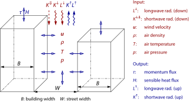
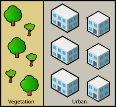

# Local Climate Zone based input for non-building resolving simulation

In the following, it is described how `palm_csd` can be used to create a static driver from Local Climate Zone (LCZ) input data for non-building-resolving PALM simulations with the urban parametrization scheme DCEP. Input of a LCZ and a orography raster map of arbitrary projections and resolution is required. The switch to enable this mode is `lcz_input` in the `domain` section.

## Configuration file

This section describes how to set-up a YAML configuration file. All variables with a default value can be omitted in the configuration file. Note that the `None` value of Python, which represents a non-defined value, is represented in the YAML file by `null`.

The configuration file consists of the following sections:

### `attributes` section

A set of global attributes can be defined that will be passed to the static driver file. Please refer to the [detailed input for building-resolving simulations](detailed_input.md#attributes-section) for this part.

### `settings` section

This section describes global parameters used to create the static driver.

| Variable | Data type | Default value | Description |
|----------|-----------|---------------|-------------|
| `epsg`                       | integer | `None` | EPSG code of the coordinate reference system (CRS) of the output and the PALM simulation. Currently, only UTM CRSs were tested. If `None`, all netCDF coordinate input files in the `input` section have to be provided. |
| `ignore_input_georeferencing`| logical | `False` | When reading GeoTIFF input, ignore its coordinate reference system (CRS), resulting in a similar behaviour as with netCDF input. In particular, both, `input_lower_left_x` and `input_lower_left_y` need to be set for each domain. |
| `season`                     | string  | `summer` | As palm_csd can work with different sets of input data regarding leaf area index, this switch parameter can be set to either `summer` or `winter` to select the most suitable leaf area index input file to account for differences in leaf amount. Data for summer is usually from August (fully leaved), while data for winter is usually from April. |
| `rotation_angle`             | float   | `0.0`  | Rotation angle of the model's North direction relative to geographical North (clockwise rotation). This value overwrites the namelist parameter of the PALM run. |

Example:

```yml
settings:
   epsg: 25832
   rotation_angle: 0.0
   season: summer
```

### `output` section

This section describes the location for the static driver output. Please refer to the [detailed input for building-resolving simulations](detailed_input.md#output-section) for this part.

### `input_ABC`, ..., `input_XYZ` sections

The configuration file can include several sets of input data for different domains. For each set of input data, an individual section must be provided and named accordingly (i.e. `input_root`, `input_N02`, etc.). If there is only one input data set, a name can also be omitted (i.e. `input`). The input files must be in netCDF or any GIS raster format (GeoTIFF recommended and tested). When using GIS files, the target coordinate reference system (CRS) must be defined in the `settings` section via `epsg` as well as the lower left corner of the target grid via `origin_x`/`origin_y` or `origin_lon`/`origin_lat` in the `domain` section. Note that `input_lower_left_x` and `input_lower_left_y` in the domain section are not needed if only GIS files are used.

The coordinate inputs `file_x_UTM`/`file_y_UTM` and `file_lon`/`file_lat` are optional. If they are not provided, `epsg` in the `settings` section and `origin_x`/`origin_y` or `origin_lon`/`origin_lat` in the `domain` section must be provided.

| Variable | Data type | Default value | Description |
|----------|-----------|---------------|-------------|
| `path`                      | string | `None` | Directory where the netCDF input files reside. |
| `pixel_size`                | float  | `None` | DEPRECATED: Horizontal target grid spacing (m) of a surface pixel. Only used to find the matching `input` section for each `domain`. Alternatively, name both, `input` and `domain` the same or use the `input` option in the `domain` section.  |
| `file_x_UTM`                | string | `None` | UTM x-coordinates for the simulation domain (m). |
| `file_y_UTM`                | string | `None` | UTM y-coordinates for the simulation domain (m). |
| `file_lat`                  | string | `None` | Latitude (degrees N) for the simulation domain. |
| `file_lon`                  | string | `None` | Longitude (degrees E) for the simulation domain. |
| `file_lcz`\*                | string |        | Local Climate Zone classification. Either in netCDF format with the target projection and pixel size, or a general GIS raster format (e.g. GeoTIFF) with arbitrary projection and pixel size. It could either consist of one Band indicating the LCZ class with values 1-17 or three bands with values indicating RGB colours with values 0-255. |
| `file_zt`                   | string | `None` | Terrain height (m). Either in netCDF format with the target projection and pixel size, or a general GIS raster format (e.g. GeoTIFF) with arbitrary projection and pixel size. |

(*) This parameter is mandatory

For a given target pixel size (i.e. horizontal grid spacing), only one set of input files can be provided. While the name of the input variable in each file is not prescribed, ensure that only one such variable is included in each file.

Example:

```yml
input_root:
   path: /path/to/input/data/
   file_lcz: LCZ.tif
   file_zt: terrain_height.tif
```

### `domain_ABC`, ..., `domain_XYZ` sections

This section contains settings for each model domain for the PALM run. If the name is omitted, the name `root` is assumed. In case of a nested run, the sections for the non-root domains must be named individually, e.g. `domain_N01`, `domain_N02`, etc. as it is done in the PALM parameter file.

The corresponding input data set for each domain can be defined in the `input` parameter. If not set, the name of both `input` and `domain` sections is used to find the matching input data set (e.g. `input_root` for `domain_root`). If there is only one `input` section, this is used.

If geographical coordinates of the output should be calculated, i.e. if they are not supplied in the input data with `file_x_UTM`, `file_y_UTM` etc., it is sufficient to either set `origin_x`/`origin_y` or `origin_lon`/`origin_lat`. Note that also `epsg` must be set in the `settings` section.

| Variable | Data type | Default value | Description |
|----------|-----------|---------------|-------------|
| `pixel_size`\*               | float   |  | Size (in m) of a single pixel in x/y direction (equal to grid spacing in x and y). |
| `lcz_input`                  | string   | `None` | Output parameters derived from LCZ data. Currently, only `None` and `full` is supported. `full` means that all parameters are derived from LCZ data except orography height.  |
| `input_lower_left_x`               | float   | `None` | Distance (in m) along x-direction between the lower-left corner of the model domain and the lower-left corner of the input data. This parameter is used to shift the model domain with respect to the provided input data. Only needed for netCDF input data. |
| `input_lower_left_y`               | float   | `None` | Distance (in m) along y-direction between the lower-left corner of the model domain and the lower-left corner of the input data. This parameter is used to shift the model domain with respect to the provided input data. Only needed for netCDF input data. |
| `lower_left_x`               | float   | `None` | Only for nested domains: Distance (in m) along x-direction between the lower-left corner of the nested domain and the lower-left corner of its root domain. This parameter is used to define the coordinates of origin of the nested domain. This parameter is not required if the origin is defined via `origin_x`/`origin_y` or `origin_lon`/`origin_lat`. |
| `lower_left_y`               | float   | `None` | Only for nested domains: Distance (in m) along y-direction between the lower-left corner of the nested domain and the lower-left corner of its root domain. This parameter is used to define the coordinates of origin of the nested domain. This parameter is not required if the origin is defined via `origin_x`/`origin_y` or `origin_lon`/`origin_lat`. |
| `origin_x`                   | float   | `None` | x-coordinate of the left border of the lower-left grid point of the PALM domain in the CRS defined by `epsg` in the `settings` section. |
| `origin_y`                   | float   | `None` | y-coordinate of the lower border of the lower-left grid point of the PALM domain in the CRS defined by `epsg` in the `settings` section. |
| `origin_lon`                 | float   | `None` | Longitude of the left border of the lower-left grid point of the PALM domain in WGS84. |
| `origin_lat`                 | float   | `None` | Latitude of the lower border of the lower-left grid point of the PALM domain in WGS84. |
| `nx`\*                       | integer |  | Number of grid points in x-direction. It equals the `nx` setting in the PALM parameter file so the actual number of grid points is `nx+1`. |
| `ny`\*                       | integer |  | Number of grid points in y-direction. It equals the `ny` setting in the PALM parameter file so the actual number of grid points is `ny+1`.  |
| `dz`\*                       | float   |  | Vertical grid spacing in PALM (m). This parameter is needed when `interpolate_terrain` is used. |
| `input`                      | string  | `None` | Name of the `input` section to be used for this domain. This parameter is used to match the input data set with the domain. If not set, the name of both `input` and `domain` sections or the `pixel_size` parameter (deprecated) is used to find the matching input data set. If there is only one `input` section, this is used. |
| `dcep`                       | logical | `True` | Generate urban parameters for DCEP. |
| `z_uhl`                      | float   | `[0.0, 5.0, 10.0, 15.0, 20.0, 25.0, 30.0, 35.0, 40.0, 50.0]`  | Height of the urban DCEP layers (m). |
| `udir`                       | float   | `[0.0, 90.0]` | Urban street directions (degrees). |
| `interpolate_terrain`        | logical | `False` | If set to `True`, the terrain height is interpolated and blended over between parent and child domains in order to avoid severe steps in terrain height due to different grid spacings between parent and child. |
| `domain_parent`              | string  | `None` | Name of the parent domain of the current domain. If the current domain is the root domain, do not set this parameter. |
| `water_temperature` | float or dictionary | `None` | Water temperature in K for one or several water types as indicated by their name or their index 0 to 5. Also allows one value, which is applied to all water types. |

(*) This parameter is mandatory

Example:

```yml
domain_root:
   lcz_input: full
   pixel_size: 100.0
   origin_x: 19605
   origin_y: 20895
   nx: 199
   ny: 199
   dz: 15.0
   water_temperature: 
      lake: 285
```

### `lcz` section

This section contains settings to overwrite the default values assigned to each LCZ. The values consists of the parameters assigned by the LCZ classification scheme and the PALM parameters. If it is a LCZ-related value, it is checked if it is within the defined valid range. Furthermore, the kind of average used when interpreting the average building height can be set.

| Variable | Data type | Default value | Description |
|----------|-----------|---------------|-------------|
| `height_geometric_mean`  | logical     | `True` |  Use the geometrical mean (`True`) or the arithmetic mean (`False`) when calculating the building height distribution for DCEP. |
| _class_                  | dictionary  | `None` | Setting of the parameters of LCZ *class* in the form of `type: value`. Use the names of classes and parameters as used in the tables in [the technical description](#local-climate-zones) |

(*) This parameter is mandatory

Example:

```yml
lcz:
  water:
    b: 255
  open_lowrise:
    building_plan_area_fraction: 0.4
    impervious_plan_area_fraction: 0.2
    aspect_ratio: 0.75
```

## Technical documentation

### DCEP

DCEP (Schubert et al. 2012)[^schubert2012] is an urban parametrization scheme that calculates the urban radiation and energy fluxes. Buildings are represented by infinitely long street canyons characterized by its building width $B$, street width $W$ and its building height distribution with the average $H$.



Urban impervious surfaces and vegetation are treated as separate tiles with grid cell fractions $f_\text{urb}$ and $1-f_\text{urb}$, respectively:



### Local Climate Zones

The Local Climate Zone (LCZ) classification (Stewart and Oke 2012)[^stewart2012] consists of the 17 classes.


(Demuzere et al. 2020)[^demuzere2020]

LCZ classifications are available for many urban areas in the World Urban Database and Access Portal Tool (Ching et al. 2018)[^ching2018].

#### Definition of parameter values

According to the definition of the LCZ classification, a valid minimum and maximum value of the following parameters are assigned to each LCZ class: mean building-height-to-street-width ratio (aspect ratio) $\lambda_S$, building surface fraction $\lambda_B$, impervious (without buildings) and pervious fraction $\lambda_I$ and $\lambda_V$, and average building height $H$. For LCZ1 and LCZ4, a maximum building height was not defined. We follow Demuzere et al. (2022)[^demuzere2022] and set these values to 75m.

For the derivation of the required PALM input values, one value within the defined valid range of each parameter is used. This value can be set by the user. The default values are taken from the [w2w default values](https://github.com/matthiasdemuzere/w2w/blob/main/w2w/resources/LCZ_UCP_lookup.csv)[^demuzere2022].

Furthermore, for each LCZ class several PALM properties are assigned: a vegetation type, a water type and a leaf area index for winter and summer. These values can also be adjusted by the user. The urban LCZ classes are assigned `Interrupted forest` under the assumption of low and high vegetation. The only additionally required data input is the orography.

The following tables summarize the assigned values for each LCZ class. The tables also show the names of the classes and parameters to be used to customize the values.

|class |              index | |    $\lambda_S$   | | |    $\lambda_B$   | | |   $\lambda_I$    | | |    $\lambda_V$   | | |   $H$              | |     r |  g  |  b  |
|------|--------------------|-|------------------|-|-|------------------|-|-|------------------|-|-|------------------|-|-|--------------------|-|-------|-----|-----|
|      |                    | min | default | max  | min | default | max  | min | default | max  | min | default | max  |  min | default | max   |       |     |     |
|`compact_highrise` |     1 |   2.00 | 2.50 | None |   0.40 | 0.50 | 0.60 |   0.40 | 0.45 | 0.60 |   0.00 | 0.05 | 0.10 |   25.0 |  avg  | 75.00 |   140 |   0 |   0 |
|`compact_midrise` |      2 |   0.75 | 1.25 | 2.00 |   0.40 | 0.55 | 0.70 |   0.30 | 0.40 | 0.50 |   0.00 | 0.05 | 0.20 |   10.0 |  avg  | 25.00 |   209 |   0 |   0 |
|`compact_lowrise` |      3 |   0.75 | 1.25 | 1.50 |   0.40 | 0.55 | 0.70 |   0.20 | 0.35 | 0.50 |   0.00 | 0.10 | 0.30 |    3.0 |  avg  | 10.00 |   255 |   0 |   0 |
|`open_highrise` |        4 |   0.75 | 1.00 | 1.25 |   0.20 | 0.30 | 0.40 |   0.30 | 0.35 | 0.40 |   0.30 | 0.35 | 0.40 |   25.0 |  avg  | 75.00 |   191 |  77 |   0 |
|`open_midrise` |         5 |   0.30 | 0.50 | 0.75 |   0.20 | 0.30 | 0.40 |   0.30 | 0.40 | 0.50 |   0.20 | 0.30 | 0.40 |   10.0 |  avg  | 25.00 |   255 | 102 |   0 |
|`open_lowrise` |         6 |   0.30 | 0.50 | 0.75 |   0.20 | 0.30 | 0.40 |   0.20 | 0.35 | 0.50 |   0.30 | 0.35 | 0.60 |    3.0 |  avg  | 10.00 |   255 | 153 |  85 |
|`leightweight_lowrise` | 7 |   1.00 | 1.50 | 2.00 |   0.60 | 0.75 | 0.90 |   0.00 | 0.10 | 0.20 |   0.00 | 0.15 | 0.30 |    2.0 |  avg  |  4.00 |   250 | 238 |   5 |
|`large_lowrise` |        8 |   0.10 | 0.20 | 0.30 |   0.30 | 0.40 | 0.50 |   0.40 | 0.45 | 0.50 |   0.00 | 0.15 | 0.20 |    3.0 |  avg  | 10.00 |   188 | 188 | 188 |
|`sparsely_built` |       9 |   0.10 | 0.15 | 0.25 |   0.10 | 0.15 | 0.20 |   0.00 | 0.10 | 0.20 |   0.60 | 0.75 | 0.80 |    3.0 |  avg  | 10.00 |   255 | 204 | 170 |
|`heavy_industry` |      10 |   0.20 | 0.35 | 0.50 |   0.20 | 0.25 | 0.30 |   0.20 | 0.30 | 0.40 |   0.40 | 0.45 | 0.50 |    5.0 |  avg  | 15.00 |    85 |  85 |  85 |
|`dense_trees` |         11 |   1.00 | 2.00 | None,|   0.00 | 0.00 | 0.10 |   0.00 | 0.00 | 0.10 |   0.90 | 1.00 | 1.00 |    3.0 |  avg  | 30.00 |     0 | 106 |   0 |
|`scattered_trees` |     12 |   0.50 | 0.65 | 0.80 |   0.00 | 0.00 | 0.10 |   0.00 | 0.00 | 0.10 |   0.90 | 1.00 | 1.00 |    3.0 |  avg  | 15.00 |     0 | 170 |   0 |
|`bush_scrub` |          13 |   0.70 | 0.80 | 0.90 |   0.00 | 0.00 | 0.10 |   0.00 | 0.00 | 0.10 |   0.90 | 1.00 | 1.00 |    0.0 | 1.000 |  2.00 |   100 | 133 |  37 |
|`low_plants` |          14 |   0.90 | 1.00 | None,|   0.00 | 0.00 | 0.10 |   0.00 | 0.00 | 0.10 |   0.90 | 1.00 | 1.00 |    0.0 | 0.500 |  1.00 |   185 | 219 | 121 |
|`bare_rock_or_paved` |  15 |   0.90 | 1.00 | None,|   0.00 | 0.05 | 0.10 |   0.90 | 0.90 | 1.00 |   0.00 | 0.05 | 0.10 |    0.0 | 0.125 |  0.25 |     0 |   0 |   0 |
|`bare_soil_or_sand` |   16 |   0.90 | 1.00 | None,|   0.00 | 0.00 | 0.10 |   0.00 | 0.00 | 0.10 |   0.90 | 1.00 | 1.00 |    0.0 | 0.125 |  0.25 |   251 | 247 | 174 |
|`water` |               17 |   0.90 | 1.00 | None,|   0.00 | 0.00 | 0.10 |   0.00 | 0.00 | 0.10 |   0.90 | 1.00 | 1.00 |    0.0 | 0.000 |  0.00 |   106 | 106 | 205 |

with

- $\lambda_S$: `aspect_ratio`
- $\lambda_B$: `building_plan_area_fraction`
- $\lambda_I$: `impervious_plan_area_fraction`
- $\lambda_V$: `pervious_plan_area_fraction`
- $H$: `height_roughness_elements`

The following table shows the default values for the assigned PALM parameters:

| class                 | vegetation_type | water_type | lai_summer | lai_winter |
|-----------------------|-----------------|------------|------------|------------|
| compact_highrise      |             18  |     None   |     1.0    |    0.1     |
| compact_midrise       |             18  |     None   |     1.0    |    0.1     |
| compact_lowrise       |             18  |     None   |     1.0    |    0.1     |
| open_highrise         |             18  |     None   |     2.0    |    0.5     |
| open_midrise          |             18  |     None   |     2.0    |    0.5     |
| open_lowrise          |             18  |     None   |     2.0    |    0.5     |
| leightweight_lowrise  |             18  |     None   |     1.0    |    0.1     |
| large_lowrise         |             18  |     None   |     0.5    |    0.1     |
| sparsely_built        |             18  |     None   |     2.0    |    0.5     |
| heavy_industry        |             18  |     None   |     0.5    |    0.0     |
| dense_trees           |              7  |     None   |     4.0    |    0.8     |
| scattered_trees       |             18  |     None   |     2.0    |    0.5     |
| bush_scrub            |             16  |     None   |     1.0    |    0.1     |
| low_plants            |             16  |     None   |     1.0    |    0.1     |
| bare_rock_or_paved    |              1  |     None   |     0.0    |    0.0     |
| bare_soil_or_sand     |              1  |     None   |     0.0    |    0.0     |
| water                 |           None  |        1   |    None    |   None     |

#### Derivation of DCEP parameters

The input parameters required by DCEP are derived from the LCZ parameters as follows:

The urban fraction $f_\text{urb}$ of a grid cell is considered to be the total impervious fraction of a grid cell $f_\text{urb} = \lambda_B + \lambda_I$. The street width $W$ is calculated from the average building height and the aspect ratio with $W = H / \lambda_S$. The building width $B$ is given by $B = \lambda_B / \lambda_I \cdot W$.

We follow the approach of Demuzere et al. (2022)[^demuzere2022] as implemented in [w2w](https://github.com/matthiasdemuzere/w2w) in the calculation of the distribution of the building height: With the probability density function $f$ of a normal distribution with the mean value $H$ and a standard deviation $(H_\text{max} - H_\text{min})/4$, the fraction $p$ of buildings at a height $h$ is given by
$$
p(h) = \int_{h-\Delta H/2}^{h+\Delta H/2} f(x)\, dx \,,
$$
with $\Delta H$ being the layer thickness. Numerically, the integral is directly calculated with the cumulative distribution function of the given normal distribution using scipy[^virtanen2020]. Contrary to Demuzere (2022)[^demuzere2022], the user can choose whether the arithmetic or the geometric mean of the building heights are to be used. In the original tool, the arithmetic average is used while the geometric mean is used in the LCZ definition[^stewart2012].

[^ching2018]: Ching, J., G. Mills, B. Bechtel, L. See, J. Feddema, X. Wang, C. Ren, et al. 2018. ‘WUDAPT: An Urban Weather, Climate, and Environmental Modeling Infrastructure for the Anthropocene’. Bulletin of the American Meteorological Society 99 (9): 1907–24. [doi: 10.1175/BAMS-D-16-0236.1](https://doi.org/10.1175/BAMS-D-16-0236.1).
[^demuzere2020]: Demuzere, Matthias, Steve Hankey, Gerald Mills, Wenwen Zhang, Tianjun Lu, and Benjamin Bechtel. ‘Combining Expert and Crowd-Sourced Training Data to Map Urban Form and Functions for the Continental US’. Scientific Data 7, no. 1 (11 August 2020): 264. [doi: 10.1038/s41597-020-00605-z](https://doi.org/10.1038/s41597-020-00605-z).
[^demuzere2022]: Demuzere, Matthias, Daniel Argüeso, Andrea Zonato, and Jonas Kittner. 2022. ‘W2W: A Python Package That Injects WUDAPT’s Local Climate Zone Information in WRF’. Journal of Open Source Software 7 (76): 4432. [doi: 10.21105/joss.04432](https://doi.org/10.21105/joss.04432).
[^schubert2012]: Schubert, Sebastian, Susanne Grossman-Clarke, and Alberto Martilli. 2012. ‘A Double-Canyon Radiation Scheme for Multi-Layer Urban Canopy Models’. Boundary-Layer Meteorology 145 (3): 439–68. [doi: 10.1007/s10546-012-9728-3](https://doi.org/10.1007/s10546-012-9728-3).
[^stewart2012]: Stewart, I. D., and T. R. Oke. 2012. ‘Local Climate Zones for Urban Temperature Studies’. Bulletin of the American Meteorological Society 93 (12): 1879–1900. [doi: 10.1175/BAMS-D-11-00019.1](https://doi.org/10.1175/BAMS-D-11-00019.1).
[^virtanen2020]: Virtanen, Pauli, Ralf Gommers, Travis E. Oliphant, Matt Haberland, Tyler Reddy, David Cournapeau, Evgeni Burovski, et al. 2020. ‘SciPy 1.0: Fundamental Algorithms for Scientific Computing in Python’. Nature Methods 17: 261–72. [doi: 10.1038/s41592-019-0686-2](https://doi.org/10.1038/s41592-019-0686-2).
